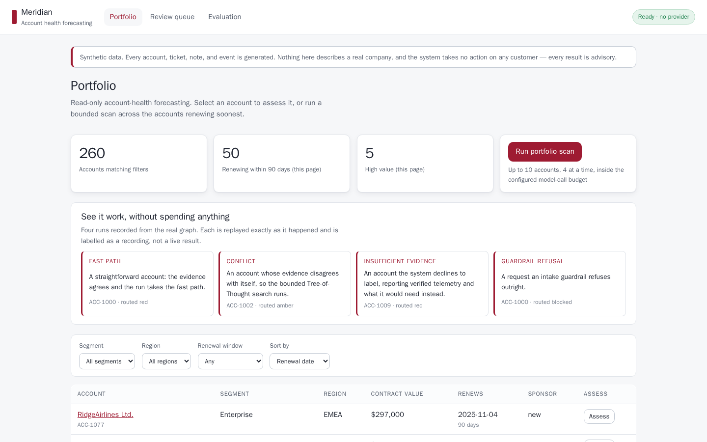
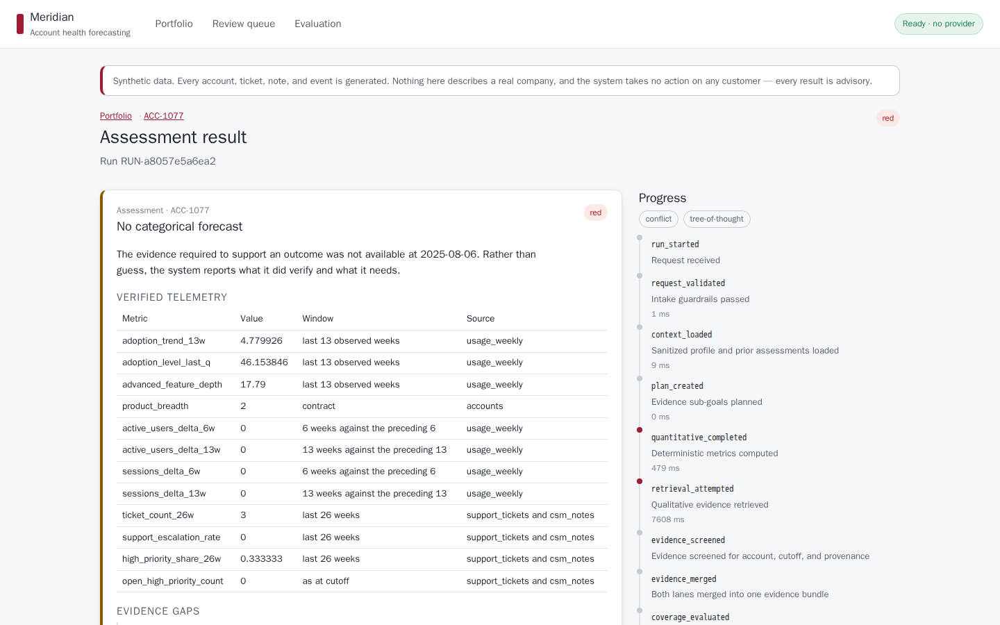
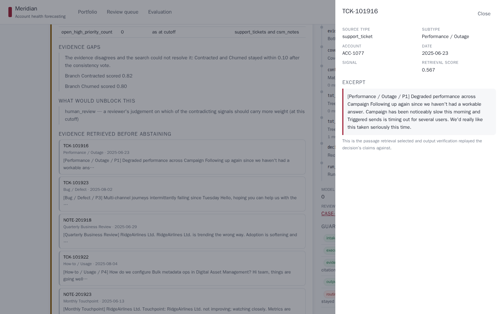

# Meridian Enterprise Account Health Forecaster

Meridian is a read-only autonomous decision-support system for renewal forecasting. Given a B2B SaaS customer account, it forecasts `Churned`, `Contracted`, `Renewed`, or `Expanded`; explains the result with exact metrics and point-in-time evidence; recommends a next step; and decides whether the advisory result can be released or needs human review.

> All account, company, person, usage, ticket, note, event, and outcome data in this repository is synthetic, generated for this project by the code in [`dataset/`](dataset/) from a documented causal model. The system is decision support and must not make customer-facing or commercial commitments.

## Who it is for, and what it is for

A customer-success team carrying two hundred accounts cannot read every ticket, note, and usage
curve before every renewal. The question they actually need answered is narrower than "how is this
account doing": it is *which accounts should I look at this week, and what should I read first when
I do*.

Meridian answers that and nothing more. It forecasts one of four renewal outcomes from
point-in-time evidence, shows the metrics and documents behind the call, and — the part that
matters — **declines when the evidence will not support an answer**. On the held-out split it
abstained on 16 of 53 accounts and sent every one of the remaining 37 to a reviewer rather than
releasing it unchecked.

It sends no email, changes no record, and commits to no price. Every result is advisory.

## How it works

Each of these is a real path through the code, not a label:

| Technique | Where it lives | What it actually does |
| --- | --- | --- |
| **Multi-agent coordination** | `meridian.agents.*`, `meridian.graph.builder` | Four agents over a 17-node LangGraph, with two evidence lanes that genuinely run in parallel (proved by overlapping wall-clock intervals, not by adjacent log lines) |
| **ReAct-style planning** | `meridian.agents.orchestrator` | The planner proposes two to four typed sub-goals; it cannot choose a structural transition, which stays deterministic |
| **RAG** | `meridian.retrieval.*` | Parent-child chunking over FAISS, account- and cutoff-filtered *before* any vector is scored, with one bounded grade/rewrite/retry |
| **Tree of Thought** | `meridian.graph.tot`, `meridian.graph.conflict` | Four candidates, six hard checks, a five-dimension rubric, beam 2, depth 2 — behind a deterministic conflict gate, so it runs on 51% of accounts rather than all of them |
| **MCP** | `meridian.tools.*` | Eight read-only tools behind the official SDK, allowlisted per agent role; the Adjudicator's allowlist is empty because section 13.4 says it makes no tool calls |
| **Memory** | `meridian.memory.store`, SQLite checkpointer | Working memory in typed graph state; long-term memory as assessment snapshots and review cases. Prior assessments are context, never a label carried forward |
| **Guardrails** | `meridian.guardrails.*` | Five typed stages — intake, execution, evidence, output, routing — accumulated on every run so a missing control is visible in the trace |
| **Human review** | `meridian.graph.nodes.await_review`, `/api/review-cases` | A LangGraph interrupt for cases that must pause, four typed reviewer actions, and an override that files a regression record in the same transaction |

## Current status

**Eleven of the twelve phases are complete**, and none of their exit gates needs an API key.
The first four involve no language model at all; Phase 4 adds the interface to one, and Phase 5
completes without one, producing a deterministic explanation and saying so in its own limitations.

The exception is **Phase 11**, public deployment. The production image is built, self-contained, and
verified locally with zero mounts. A Render free-plan service answers at `meridian-125g.onrender.com`,
but it is serving a build that predates the knowledge-base fix and so returns no forecasts until it
is redeployed, and the cold-start measurement is still outstanding. Everything else in this README
runs from a clone. See [`docs/PHASE_11_STATUS.md`](docs/PHASE_11_STATUS.md).

Phase 0 delivered the engineering foundation: a typed FastAPI service, a React/TypeScript health UI,
validated environment settings, Docker Compose, quality commands, CI, pre-commit hooks, and
architecture decision records. Verify it with `make phase0-verify`; evidence is in
`docs/PHASE_0_STATUS.md`.

Phase 1 delivered the point-in-time-safe data layer: a central validating loader, enforced per-account
cutoffs, a sanitized runtime boundary separated from evaluation labels, deterministic splits, and a
provenance manifest. Verify it with `make validate-data`; evidence is in `docs/PHASE_1_STATUS.md` and
`docs/DATA_LINEAGE.md`.

Phase 2 delivered the calibrated forecaster: features recomputed from observable telemetry at an
arbitrary cutoff, five candidates including two documented baselines, one-standard-error selection,
and isotonic calibration. Train with `make train` and forecast one account with
`make predict ACCOUNT=ACC-1042`; evidence is in `docs/PHASE_2_STATUS.md` and `docs/MODEL_CARD.md`.

Phase 3 delivered point-in-time-safe semantic retrieval: parent-child chunking over sanitized text,
a local FAISS index governed by a SQLite metadata store, dual-lane account and knowledge-base search
with MMR reranking, deterministic relevance grading with one bounded rewrite and retry, and a
four-family retrieval benchmark with a chunking ablation. Build the index with `make index`, query it
with `make retrieve ACCOUNT=ACC-1089 QUERY="renewal risk"`, and reproduce every number with
`make evaluate-retrieval`; evidence is in `docs/PHASE_3_STATUS.md`.

Phase 4 delivered the tool and provider boundary: eight read-only services with a per-role
allowlist, Pydantic validation, bounded retries and an audit trail, exposed over the official MCP
SDK with an in-process client; plus a provider-neutral structured-generation interface with an
OpenAI-compatible adapter, deterministic fakes, and skeletons that say exactly what to configure.
Evidence is in `docs/PHASE_4_STATUS.md`.

Phase 5 delivered the four agents and the LangGraph fast path: typed shared state with explicit
reducers, intake guardrails, a bounded planner over a closed sub-goal vocabulary, quantitative and
retrieval lanes that genuinely run in parallel, a deterministic coverage gate with one targeted
evidence retry, adjudication whose numeric claims and citations are replayed against verified
evidence, deterministic confidence and human-review routing, a SQLite checkpointer, and a streamed
safe trace. Run one assessment with `make assess ACCOUNT=ACC-1042 OFFLINE=1`; evidence is in
`docs/PHASE_5_STATUS.md`.

Phase 6 delivered the conflict gate and the bounded Tree-of-Thought subgraph: eight deterministic
conflict triggers, one argued candidate per canonical outcome, six hard checks that reject a branch
outright, a frozen five-dimension critic rubric, a beam of two, one stress test per survivor, one
consistency vote, and an abstention with a red review case when a tie persists. Reproduce the
linear-versus-ToT comparison with `make evaluate-tot`; evidence is in `docs/PHASE_6_STATUS.md`.

That comparison is worth reading before trusting the feature. Over the development split the gate
fires on 51% of accounts, and in the offline configuration the search agrees with the linear path
on 86.5% of the cases both answer while declining 69 answers to catch 12 errors. Phase 6 delivers
the structure the plan specifies and the measurement showing the structure alone is not yet enough.

Phase 7 delivered the complete safety and human-review layer: five typed guardrail stages, hard
runtime spending and tool-surface bounds, evidence-envelope and citation isolation, deterministic
routing, resumable red-case interrupts, a persisted four-action review queue, atomic reviewer
regressions, and a 36-case offline safety report. The gate recorded zero hard false passes, zero
false blocks, zero leakage findings, and zero tokens. Reproduce it with
`make evaluate-guardrails`; evidence is in `docs/PHASE_7_STATUS.md`.

Phase 8 delivered the served system: the whole of the plan's endpoint table, a Server-Sent
Events stream of safe progress for one run, the bounded autonomous portfolio scan, an optional
scheduled worker that refuses to spend unattended where the plan forbids it, a CLI, and demo-mode
and rate-limit controls. A scan holds its configured concurrency and model-call budget --
measured from inside the worker pool rather than reported from its settings -- and
`scripts/scan_portfolio.py` exits non-zero if either bound is breached.

It also produced an uncomfortable number worth stating up front: under the original bands **a
portfolio scan auto-released nothing** — all six accounts queued for review, which saves a CS team
no work. Section 22.7 forbids tuning thresholds outside a development-split measurement, so that
number stood until the measurement was done. Under thresholds v2 the same scan releases **1 of 6**
and routes 2 amber and 3 red. One in six is still thin, and it is stated here rather than rounded
up. Evidence is in `docs/PHASE_8_STATUS.md`.

Phase 9 delivered the application: a portfolio, an account page with its 104-week trajectory and
effective-cutoff marker, a live assessment view fed by Server-Sent Events, the decision card with a
confidence gauge and a clickable evidence drawer, a review queue where an override files a
regression record, and an evaluation page that reads published artifacts. **24 Playwright journeys
pass across desktop and tablet with none skipped**, and one of them subscribes to every API response
the browser receives and fails on any latent field or prompt key. Evidence is in
`docs/PHASE_9_STATUS.md`.

Phase 10 froze the decision thresholds, ran the held-out evaluation against them, and wired
mandatory structured tracing with optional LangSmith mirroring.

**On the held-out split (53 accounts, thresholds `cbf44c84e4501881`, v2):** macro F1 **0.749** against
a 0.460 majority baseline, supported-claim rate and exact numeric agreement both **1.000**, and
**zero** wrong-account or post-cutoff citations. Expected calibration error is **0.171** against a
0.10 target — not met, and not fixed here, because recalibrating after seeing a held-out number is
the thing section 22.7 exists to prevent.

**It auto-releases 2 of 53, and it used to release none.** The routing was always working — on the
development split the error rate rises 0.000 (green) → 0.029 (amber) → 0.127 (red), and all eight
errors landed in red — but under v1's bands nothing at all cleared green, and a system whose entire
output is review load saves nobody any work.

The cause turned out not to be the bands. The composed confidence runs about **0.19 below observed
accuracy**: on development, mean confidence 0.740 against 0.927 accuracy, with every reliability bin
below the diagonal. Thirty-eight development runs scored 0.80–0.90 and *every one of them was
correct*, under a green band that started at 0.85. So v2 moves green to 0.80 — and moves the two
caps that must sit below it from 0.84 to 0.79, because leaving them would have auto-released four
runs with an exhausted retrieval gap, which is precisely what those caps exist to stop.

Development auto-release goes 6 → 15 of 207 with **zero** errors among them; held out, 0 → 2 of 53,
both correct, neither capped. Chosen on development data only, as section 22.7 requires, then
measured once on held out. Evidence is in `docs/DECISIONS.md` (D-061) and `docs/PHASE_10_STATUS.md`.

Phase 11 delivered the deployable system: a multi-stage production image that serves the API and
the built SPA from one container, a Render blueprint with demo mode, per-client rate limits and a
scheduler switch, and a curated demo cache of four recorded runs -- every one produced by the real
graph, and every one labelled as recorded so a viewer is never shown a replay as if it were live.
The image was verified running locally the way Render runs it. Evidence is in `docs/DEPLOYMENT.md`,
which also states the one thing that is not solved: the image ships without the dataset, the model,
and the retrieval index, so a deployment today starts degraded until one of three documented options
is chosen.

Phase 12 assembled the evidence package: every claim mapped to the code or artifact behind it, the
architecture diagram corrected against the compiled graph, four representative traces captured from
real runs, and a stage-by-stage record of which design commitments held, changed, or were never
built. The evaluation artifacts are committed rather than gitignored, because a citation to a path
no clone contains is not evidence. Start at `docs/EVIDENCE_MAP.md`.

## What it looks like



*The portfolio: summary cards, filters, and the accounts renewing soonest. The banner is not
decoration — everything here is synthetic, and the system takes no action on any customer.*



*A finished assessment. This account's evidence conflicted and the bounded search could not resolve
it, so the system reports verified telemetry and **no categorical outcome** rather than guessing.
The timeline on the right is streamed live; the red markers are the two evidence lanes running in
parallel.*



*Every citation is inspectable by source id, type, date, and excerpt — the passage retrieval
selected and output verification replayed the decision's claims against.*

The remaining screenshots — the account page, the review queue, and the evaluation dashboard — are
in `docs/screenshots/`, regenerated from the running build with `make screenshots`.

### What one assessment does

```text
validate_request ─► load_context ─► plan_sub_goals ─┬─► quantitative_lane ─┬─► merge_evidence
       │ blocked                                    └─► retrieval_lane  ───┘        │
       ▼                                                                  ┌─────────┴─────────┐
  safe_refusal                              targeted_retry ◄─ recoverable─┤  coverage gate    │
                                                    │                     └───┬───────────┬───┘
                                                    └────────────────────►    │ critical  │ sufficient
                                                                              ▼           ▼
                                                                    degraded_result   conflict_gate
                                                                              │        │        │
                                                                              │  no conflict  conflict
                                                                              │        ▼        ▼
                                                                              │  fast_adjud.  tot_adjud.
                                                                              │        │        │ tie
                                                                              │        ▼        │
                                                                              │  verify_output ◄┘
                                                                              │   │ pass │ fail
                                                                              └───┴──►assign_route ─► persist
                                                                                                      │ red + interactive
                                                                                                      ▼
                                                                                                await_review ─► resume
```

The outcome label always comes from the calibrated forecaster. A language model, when one is
configured, writes the rationale, the limitations, and the recommended action -- and every number
and citation it writes is replayed against the verified evidence before release.

## Quick start

**Docker Compose v2 and GNU Make are the only hard prerequisites.** Every gate runs in containers,
so no host Python or Node toolchain is required.

Build and run the single-container image. It carries its own data (see [The dataset](#the-dataset)
for what that data is):

```bash
make prod-build       # builds the data, the index, and the model into the image
make prod-up          # http://localhost:8080
```

That is the whole setup. No unzipping, no `.env`, no API key, and no
`make bootstrap`: the image builds everything the application reads from the committed
`meridian-account-health.zip`, so it runs with no mounts and no external services. Allow about ten
minutes for the first build — almost all of it embedding 17,140 documents for the retrieval index —
and seconds for later ones, since it is a cached layer. Assessments take about a second.

`make bootstrap` is still the right command if you want those artifacts **on the host**, for
`make assess`, the evaluation harnesses, or the browser suite:

```bash
unzip meridian-account-health.zip -d data/raw/
cp .env.example .env
make bootstrap        # sanitized tables, retrieval index, calibrated forecaster, demo runs
```

No API key is required. Without one the system runs its deterministic path end to end, spends nothing,
and says so in its own stated limitations.

`docker compose up --build` builds and runs the same code as a two-container development stack on
ports 5173 and 8000. It deliberately mounts no data, so use it for working on the code, not for
seeing the system work.

Native development additionally needs Python 3.11 or 3.12, uv 0.12, Node.js 22.12 or newer, and
pnpm 11. With those installed:

```bash
cp .env.example .env
make setup
make dev
```

Open the UI at `http://localhost:5173`, the API health endpoint at
`http://localhost:8000/api/health`, and interactive API documentation at
`http://localhost:8000/docs`. `make dev` is the documented one-command startup after setup.

Both development containers have explicit health checks, and the frontend waits for a healthy API.

To generate both dependency lockfiles and run the complete Phase 0 acceptance suite through Docker:

```bash
make phase0-verify
```

The command leaves the stack running, but that stack is the gate's own: compose mounts no data, so
`/api/health` reports `degraded`, every subsystem reads `absent`, and the UI shows a Degraded banner.
That is the health endpoint working, not a failure. For an application with the data actually
mounted, use `make prod-up` on `http://localhost:8080` as in [Quick start](#quick-start).

## Quality gates

```bash
make data              # build sanitized tables, manifest, and the account split (Docker)
make validate-data     # the complete data-safety gate, including reproducibility (Docker)
make phase0-verify     # the complete Phase 0 acceptance suite (Docker)

make train             # train, calibrate, and persist the forecaster (Docker)
make predict ACCOUNT=ACC-1042            # forecast one account (Docker)
make index             # build the FAISS retrieval index (Docker, several minutes)
make retrieve ACCOUNT=ACC-1089 QUERY="renewal risk"   # retrieve evidence as JSON (Docker)
make evaluate-retrieval  # retrieval benchmark and chunking ablation (Docker, ~20 minutes)
make assess ACCOUNT=ACC-1042 OFFLINE=1   # one end-to-end assessment, no provider (Docker)
make evaluate-tot        # linear versus conflict-gated ToT ablation (Docker, ~10 minutes)
make evaluate-guardrails # all 36 safety cases; writes artifacts/safety/ (Docker, offline)
make scan LIMIT=10       # one bounded portfolio scan; writes artifacts/portfolio/ (Docker)
make evaluate-system     # all five evaluation dimensions; writes artifacts/evaluation/ (Docker)
make e2e                 # 24 Playwright journeys against the real stack (Docker)
make screenshots         # regenerate docs/screenshots/ from the running UI (Docker)
make bootstrap           # data, index, model, and curated demo runs, from a fresh clone
make prod-build          # build the single-container production image
make prod-up             # run it on :8080 the way Render will

make format         # apply source formatting          (needs a host toolchain)
make lint           # Python and TypeScript linting    (needs a host toolchain)
make typecheck      # strict Python and TypeScript     (needs a host toolchain)
make test           # backend and frontend tests       (needs a host toolchain)
make check          # all non-formatting local gates   (needs a host toolchain)
```

Every Docker-marked target runs through `scripts/python_in_docker.sh`, so they work without a host
Python. `make validate-data` sets `MERIDIAN_REQUIRE_DATASET=1`, which turns a missing dataset
into an error rather than silently skipping the data-safety tests.

GitHub Actions applies locked installs, format checks, linting, typing, tests, coverage thresholds,
the frontend production build, the repository policy scan, and both Docker builds. Dependency ranges
are declared in `pyproject.toml` and `frontend/package.json`; `uv.lock` and `pnpm-lock.yaml` record the
resolved environments.

## Current API contract

`GET /api/health` reports each subsystem separately, so a container with no dataset says
`degraded` rather than `ok`:

```json
{
  "status": "ok",
  "service": "meridian-api",
  "version": "0.1.0",
  "environment": "development",
  "data_mode": "synthetic"
}
```

The served surface is the plan's endpoint table, and a test asserts the OpenAPI path set
matches it exactly:

| Method and route | Purpose |
| --- | --- |
| `GET /api/health` | Service, model, index, database, and provider readiness |
| `GET /api/accounts` | Filtered, sorted, paginated sanitized portfolio |
| `GET /api/accounts/{account_id}` | Sanitized profile and this system's own advisory history |
| `POST /api/assessments` | Start one graph run; returns immediately |
| `GET /api/assessments/{run_id}` | Current or final state projection |
| `GET /api/assessments/{run_id}/events` | SSE stream of safe progress events |
| `POST /api/portfolio-scans` | Start a bounded portfolio scan |
| `GET /api/portfolio-scans/{scan_id}` | Scan summary and per-account statuses |
| `GET /api/review-cases` | Filtered review queue |
| `GET /api/review-cases/{case_id}` | Full decision card |
| `POST /api/review-cases/{case_id}/decision` | Approve, override, request data, or escalate |
| `GET /api/review-regressions` | Exported regression records |
| `POST /api/evaluations` | Refuses, and names the command to run (see below) |
| `GET /api/evaluations/{eval_id}` | Metrics from the last command-line run |
| `GET /api/demo-runs` | The curated runs this deployment can replay |
| `GET /api/demo-runs/{kind}` | One recorded run, marked as a recording |

Evaluations are deliberately **not** runnable over HTTP. Every harness reads outcome labels, and
no served module may import the evaluation package, so a route that ran one in-process would put
label-reading code one unauthenticated call away. `POST` refuses and names the command; `GET`
serves the artifact that command wrote.

The only writes this API has are a reviewer's decision on an existing case. Nothing it exposes
mutates Meridian source data.

## Verified dataset snapshot

- 260 accounts
- 67,223 usage rows
- 6,408 support tickets
- 6,420 CSM notes and QBRs
- 595 external events
- 12,860 account and knowledge-base corpus records
- 32 knowledge-base documents
- 23 golden evaluation questions
- 36 guardrail cases
- Deterministic seed: `20260721`
- Dataset as-of date: `2026-06-28`
- Forecast horizon: 90 days

The raw package contains records after some accounts' effective forecast cutoffs. Runtime ingestion must therefore sanitize data before any model or retrieval work.

## Final architecture

The system uses four logical agents coordinated by LangGraph:

1. **Orchestrator / Planner** — decomposes the assessment, checks evidence coverage, and routes the workflow.
2. **Quantitative Analyst** — runs deterministic metrics and the calibrated predictive model.
3. **Evidence Retriever** — performs account-scoped semantic retrieval and one bounded grade/rewrite/retry cycle.
4. **Forecast Adjudicator** — uses a linear fast path for aligned evidence and bounded Tree-of-Thought only for material conflicts.

MCP-compatible interfaces expose typed, read-only tools and resources. A safety boundary validates inputs, enforces point-in-time access, verifies outputs, computes confidence, and routes green, amber, red, or blocked cases.

## Documentation map

- `AGENTS.md` — repository operating instructions
- `docs/PROJECT_CONTEXT.md` — problem, users, and what each design stage committed to
- `docs/EVIDENCE_MAP.md` — every claim mapped to the code or artifact behind it
- `docs/DESIGN_EVOLUTION.md` — which design commitments held, changed, or were not built
- `docs/REQUIREMENTS.md` — numbered requirements and acceptance conditions
- `docs/ARCHITECTURE.md` — final architecture and control flow
- `docs/DATA_SAFETY.md` — cutoff, leakage, immutability, and validation policy
- `docs/DECISIONS.md` — accepted and open architectural decisions
- `docs/DEPLOYMENT.md` — the production image, `render.yaml`, and the deployment runbook
- `docs/SOURCE_INVENTORY.md` — source artifacts and hashes
- `docs/VERIFICATION_MATRIX.md` — verified claims, evidence, and unresolved items
- `docs/Meridian_Autonomous_System_Implementation_Plan.md` — full phased build specification
- `docs/adr/` — accepted architecture decision records
- `docs/PHASE_0_STATUS.md` — exit-gate evidence and remaining validation
- `docs/PHASE_1_STATUS.md` — data-layer exit-gate evidence
- `docs/PHASE_2_STATUS.md` — model exit-gate evidence and the two documented departures from the plan
- `docs/PHASE_3_STATUS.md` — retrieval exit-gate evidence, benchmark, and chunking ablation
- `docs/PHASE_4_STATUS.md` — tool-layer and provider-adapter exit-gate evidence
- `docs/PHASE_5_STATUS.md` — fast-path graph and deterministic review-routing evidence
- `docs/PHASE_6_STATUS.md` — conflict-gated Tree-of-Thought evidence and ablation
- `docs/PHASE_7_STATUS.md` — safety evaluation and human-review workflow evidence
- `docs/PHASE_8_STATUS.md` — served API, portfolio scan, and its bounds
- `docs/PHASE_9_STATUS.md` — the React application, its journeys, and what they found
- `docs/PHASE_10_STATUS.md` — frozen thresholds, the held-out evaluation, and its limitations
- `docs/PHASE_11_STATUS.md` — the production image, the deployment attempt, and why it is not finished
- `docs/PHASE_12_STATUS.md` — the evidence package and its exit gate
- `docs/DATA_LINEAGE.md` — archive provenance and byte-exact reproduction
- `docs/MODEL_CARD.md` — generated card for the served forecaster
- `docs/ENVIRONMENT.md` — observed and supported development environments

## Repository boundaries

- `backend/` — FastAPI application and Python tests
- `frontend/` — React/TypeScript application and Vitest tests
- `backend/src/meridian/graph/` — LangGraph orchestration and resumable workflow
- `backend/src/meridian/tools/` — typed business services and MCP adapters
- `backend/src/meridian/retrieval/` — sanitized indexing and retrieval
- `evaluation/` — deterministic evaluation harnesses and evaluation-only data access
- `config/` — non-secret configuration examples
- `data/` — immutable raw inputs and ignored generated artifacts

## The dataset

Every account, company, person, usage record, ticket, note, event, and outcome in this project is
synthetic. I designed and generated the dataset for this system — it is not a public corpus and was
not supplied by anyone. Nothing here describes a real company or a real person.

That matters for more than compliance. The data comes from an explicit causal model, so the true
drivers of each outcome are **known** rather than inferred, and `ground_truth_drivers.json` is what
makes driver attribution measurable at all: the reported driver overlap of 0.4279 on the held-out
split is scored against the generator's own causal record. The 23 golden retrieval questions and the
36 guardrail cases were written the same way, which is why the safety and retrieval suites have a
correct answer to grade against rather than a plausible one.

`meridian-account-health.zip` (4.2 MB) is committed, so a fresh clone can run every gate after one
command:

```bash
unzip meridian-account-health.zip -d data/raw/
```

The extracted tree under `data/raw/` is git-ignored: it is 38 MB, and 27.5 MB of that is
re-serialized JSONL that no code in this repository reads. Raw data is immutable by policy —
`meridian.data.paths` writes only to `data/processed/`, `data/splits/`, `data/indexes/`, `models/`,
and `artifacts/`.

`dataset/` holds the generator source, data dictionary, validation report, and all 32 knowledge-base
articles as ordinary files, so how the data was produced is readable on GitHub without downloading
anything:

```text
dataset/
  build_dataset.py          entry point
  generators.py             account, usage, ticket, note, and event synthesis
  config.py                 seed 20260721, the 2026-06-28 as-of date, distributions
  text_banks.py             the phrase banks behind note and ticket prose
  build_knowledge_base.py   the 32 KB articles
  build_guardrail_eval.py   the 36 packaged guardrail cases
  DATA_DICTIONARY.md        column-level reference
  eval/validation_report.md the generator's own validation summary
  knowledge_base/           KB-001 … KB-032
```

Those files are byte-exact copies of what is inside the archive, and
`backend/tests/test_dataset_source.py` fails the build if the two ever diverge.

The generator is deterministic: `test_every_table_reproduces_the_shipped_archive` re-runs it at seed
`20260721` and asserts every table reproduces the committed archive byte for byte. That requires
`numpy < 2.5` — 2.5 alters one generated note body — which is why `pyproject.toml` caps it. See
`docs/DATA_LINEAGE.md`.

## Running the public demo

The deployment is not live yet — see `docs/DEPLOYMENT.md` for the runbook and the two
blockers. What the configuration already does, when it is:

- **Demo mode** (`MERIDIAN_DEMO_MODE=true`) restricts assessments to the synthetic portfolio and
  replaces free text with a curated question. A dropdown is a convenience for a person and no
  obstacle at all to anyone calling the API directly, so both are enforced server-side.
- **Portfolio scans and evaluation runs are refused outright.** Either can spend many model calls
  from one unauthenticated click.
- **Rate limits**: 20 runs per client per hour, 200 per day across the service.
- **The scheduler cannot run.** It requires `enable_scheduler` *and* the absence of demo mode, and
  refuses rather than starting in a reduced form.
- **Four curated runs are replayed from cache** — a fast-path assessment, a conflicting one, an
  abstention, and a guardrail refusal — so a visitor can see the system work without spending
  anything. Each is labelled a recording, with the commit and moment it was recorded. There is no
  flag that removes that label.
- **A free Render instance sleeps** and takes roughly 50 seconds to wake. That is the plan, not the
  application.

The API key is declared `sync: false` in `render.yaml`, so it is stored as a hosting secret and
never written to this repository. Leaving it unset is a supported configuration: the system
completes without a provider, writes a deterministic narrative, and says so in its own limitations.

## Licence and acknowledgments

Licensed under the [Apache License 2.0](LICENSE). See [`NOTICE`](NOTICE) for the synthetic-data and
decision-support statements that travel with it.

The dataset, its generator, the knowledge base, and the evaluation sets are my own work, released
under the same licence as the code. They are fully synthetic and reproduce byte for byte from seed
`20260721`. `dataset/` is a browsable copy of the committed archive, and a test fails the build if
the two diverge.

Built with LangGraph, FastAPI, scikit-learn, FAISS, fastembed, React, and the Model Context Protocol
SDK.
