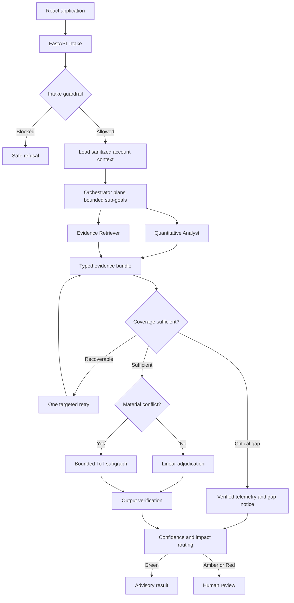

# Architecture

## System boundary

Meridian is a modular-monolith backend plus a React frontend. It uses immutable synthetic source data, generated runtime-safe artifacts, typed service functions, MCP-compatible tool interfaces, LangGraph orchestration, a provider-neutral LLM adapter, and local persistence.

The system is read-only with respect to Meridian source data. It may persist internal assessments, traces, review cases, and reviewer feedback.

## End-to-end flow

Structural transitions are deterministic. LLMs may propose typed sub-goals, summarize evidence, generate candidate hypotheses, and score qualitative rubric dimensions, but they do not decide policy edges through unrestricted prose.

## Four logical agents

### Orchestrator / Planner

- Validates the assessment objective after intake.
- Produces two to four typed sub-goals.
- Dispatches quantitative and retrieval work.
- Checks evidence sufficiency after fan-in.
- Requests at most one additional evidence round.
- Does not compute metrics, retrieve documents directly, or make the final forecast.

### Quantitative Analyst

- Deterministic node; no LLM is required.
- Computes point-in-time metrics, coverage, calibrated probabilities, and observable drivers.
- Returns exact windows, row counts, and provenance.
- Returns a typed critical gap instead of estimating missing numbers.

### Evidence Retriever

- Searches account-scoped qualitative sources and the general knowledge base separately.
- Enforces account, cutoff, date, source, and authorization filters.
- Preserves parent/child citation metadata.
- Grades relevance and coverage.
- Rewrites and retries once when evidence is thin, stale, off-topic, or duplicate-heavy.

### Forecast Adjudicator

- Uses a linear fast path when evidence agrees.
- Runs bounded candidate comparison only when the deterministic conflict gate fires.
- Produces a typed forecast or abstention from the existing evidence bundle.
- Cannot introduce new facts, perform new unrestricted retrieval, or override hard policy.

## Evidence lanes

### Deterministic lane

Consumes structured account attributes, weekly usage, support aggregates, external-event aggregates, and a runtime-safe feature set. It produces exact metrics, coverage, calibrated class probabilities, and non-causal feature contributions.

### Semantic lane

Indexes CSM notes/QBRs, ticket text, sanitized external-event documents, and the 32-document knowledge base. It uses local embeddings and FAISS, hard metadata filters, parent-child retrieval, candidate depth 20, and bounded MMR/reranking to return no more than five account citations and two knowledge citations per sub-goal.

Numeric telemetry and target/latent fields never enter the semantic index.

## Shared state

LangGraph owns a typed state containing request, account profile, plan, quantitative evidence, retrieval evidence, coverage, retries, conflict assessment, candidates, draft, verification, final result, route, review case, errors, and safe trace summaries.

Parallel nodes write distinct keys. An explicit fan-in node constructs the shared evidence bundle.

MCP receives validated run, account, requester, and cutoff context for each tool call. It exposes tools/resources; it is not used as an implicit graph-memory bus.

## Conflict-gated Tree-of-Thought

- Triggered only by material disagreement, near-tied model probabilities, or opposing verified evidence.
- Missing evidence alone does not trigger ToT.
- Generates one candidate for each of four outcomes.
- Hard-prunes candidates that violate metrics, cutoff, account, target-leakage, citation, or counterevidence rules.
- Keeps the top two soft-scored candidates.
- Stress-tests each survivor once against its strongest verified disconfirming evidence.
- Selects only when quality and margin thresholds pass; otherwise abstains and routes to review.
- Stores structured candidate summaries and scores, never hidden free-form reasoning.

## Safety boundary

Safety spans:

- Input validation and policy blocking
- Runtime/evaluation data separation
- Tool allowlists and typed arguments
- Account and point-in-time retrieval enforcement
- Evidence and output verification
- Deterministic confidence and impact routing
- Human interrupt/resume
- Structured tracing and regression capture

## Persistence

- SQLite-backed LangGraph checkpointer for resumable local runs
- Assessment and review repositories for application memory
- SQLite parent-document and metadata store for retrieval
- FAISS vector index for local embeddings
- Versioned model, data, index, evaluation, and trace manifests

Prior assessments are context, not truth. Every new assessment must re-query point-in-time evidence.

## Superseded implementation details

The Checkpoint 4.1 table mapped generator and critic roles to CrewAI and LangChain and described MCP as a state manager. The latest implementation plan supersedes that mapping:

- No CrewAI dependency is required for version 1.
- LangGraph implements the generator/critic subgraph and all orchestration.
- MCP exposes typed tools and resources.
- LangGraph state and checkpointers hold per-run state.

This preserves the submitted capabilities while avoiding multiple competing orchestration frameworks.
