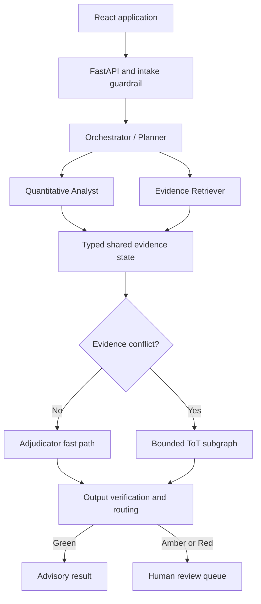
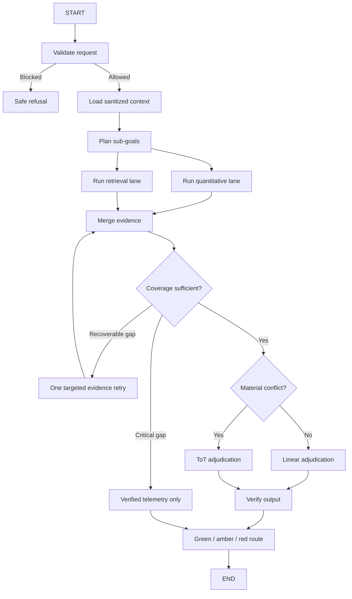

# Meridian Enterprise Account Health Forecaster

## Detailed Autonomous Agentic AI System Implementation Plan

**Purpose:** This document is the build specification for the final CMU Agentic AI Program capstone. It is written so that a coding agent such as Claude Code, Codex, Grok, Gemini CLI, or another capable software agent can implement the application without needing to reinterpret the submitted project requirements.

**Primary build target:** Local Docker with a React and TypeScript frontend, FastAPI backend, LangGraph orchestration, an MCP-compatible tool layer, local FAISS retrieval, and a provider-neutral LLM adapter.

**Public portfolio target:** A single-container Docker deployment on Render connected to the public GitHub repository. The public application must operate in a protected demo mode with rate limits, bounded model calls, and cached demonstrations when live model access is unavailable.

**Canonical dataset:** `meridian-account-health.zip`, generated with `RANDOM_SEED = 20260721` and `AS_OF_DATE = 2026-06-28`.

---

## 1. Executive objective

Build a read-only autonomous decision-support system that evaluates a fictional Meridian customer account, forecasts one of four renewal outcomes, explains the drivers with verifiable evidence, recommends a next action, and autonomously decides whether the result can be released as advisory output or must be sent to a human reviewer.

The four canonical outcome values are:

| Internal value | User-facing label |
| --- | --- |
| `Churned` | Churn |
| `Contracted` | Contraction |
| `Renewed` | Flat renewal |
| `Expanded` | Expansion |

The application is not a chatbot wrapped around a dataset. It must demonstrate the complete autonomous loop:

1. Validate the request and account scope.
2. Plan the assessment.
3. Run deterministic quantitative analysis and account-scoped semantic retrieval in parallel.
4. Assess evidence coverage and reconcile gaps.
5. Use a linear forecast path when evidence agrees.
6. Invoke bounded Tree-of-Thought only when material conflicts exist.
7. Verify every numeric and qualitative claim.
8. Calculate evidence-aware confidence.
9. Auto-release a safe advisory result or create a human-review case.
10. Persist the assessment, decision trace, citations, coverage, and reviewer feedback.

The source datasets remain immutable. Autonomy applies to analysis, orchestration, verification, routing, and internal review-case creation. The system must never contact customers, change customer records, approve discounts, send contracts, or make other consequential external commitments.

---

## 2. Locked requirements and traceability

The following requirements came from the submitted checkpoints and are non-negotiable unless a later checkpoint explicitly superseded an earlier implementation detail.

| Source | Locked requirement | Implementation commitment |
| --- | --- | --- |
| Checkpoint 1.1 | Forecast renewal outcome, explain drivers, recommend action, and admit insufficient evidence | Typed `ForecastDecision` and `InsufficientEvidenceDecision` outputs |
| Checkpoint 1.1 | Intended users are CSMs, FEs, TAMs, CS leaders, and reviewers | Portfolio, account, assessment, and review-queue screens |
| Checkpoint 2.1 | ReAct-style iterative reasoning | Orchestrator plan, parallel actions, observations, coverage gate, bounded retry loop |
| Checkpoint 2.1 | Separate deterministic computation from probabilistic reasoning | Quantitative Analyst calls code-only tools; the LLM never calculates telemetry metrics |
| Checkpoint 2.1 | Working and long-term memory | LangGraph state/checkpointer plus persisted assessment history and reviewer feedback |
| Checkpoint 2.1 | Reconcile conflicts or escalate | Deterministic conflict gate, scoped ToT, and review routing |
| Checkpoint 3.1 | Semantic retrieval only for qualitative evidence | FAISS index for notes, tickets, QBRs, events, and the knowledge base; telemetry is excluded |
| Checkpoint 3.1 | BGE or E5 embeddings, FAISS prototype, Pinecone production path | Default `BAAI/bge-small-en-v1.5` with FAISS; vector-store adapter retained |
| Checkpoint 3.1 | Parent-child chunking, top-k 5, MMR/reranking | Child chunks retrieve precisely; parent documents supply context; candidate 20 to MMR 5 |
| Checkpoint 3.1 | Hard `account_id`, date, and recency filters | Metadata filtering occurs before result acceptance and is verified after retrieval |
| Checkpoint 3.1 | Target label never retrievable | Outcome and latent fields are absent from runtime profiles, tools, prompts, and indexes |
| Checkpoint 4.1 | ToT only at conflict adjudication | A conditional LangGraph subgraph, never a default reasoning mode |
| Checkpoint 4.1 | Four root hypotheses, depth 2, beam width 2 | Explicit candidate generation, hard pruning, top-two stress test, and bounded tie handling |
| Checkpoint 4.1 | Deterministic hard checks plus LLM critic soft scoring | Hard validator can veto any branch; critic cannot override hard policy |
| Checkpoint 5.1 | Exactly four specialized agents | Orchestrator/Planner, Quantitative Analyst, Evidence Retriever, Forecast Adjudicator |
| Checkpoint 5.1 | Hybrid compiled graph with parallel evidence lanes | LangGraph `StateGraph` with explicit nodes, edges, fan-out, fan-in, and bounded cycles |
| Checkpoint 5.1 | Shared-state source of truth | Typed LangGraph state with persistent checkpoints; tools/resources exposed through MCP |
| Instructor feedback after 5.1 | Handle exhausted retrieval without blindly forecasting | Verified-telemetry degraded response, evidence-gap notice, targeted data request, and impact-aware escalation |
| Checkpoint 6.1 | Layered intake, execution, adjudication, output, runtime guardrails | Dedicated policy functions and graph nodes at every boundary |
| Checkpoint 6.1 | Green, amber, and red human-review routing | Frozen threshold configuration and review-case workflow |
| Checkpoint 6.1 | Five-dimension evaluation scorecard | Forecast, grounding, calibration, safety routing, and operational reliability suites |
| Checkpoint 6.1 | LangSmith tracing and regression loop | Optional LangSmith integration plus mandatory local structured traces |
| Module 7 | Public GitHub repository and reproducible review | Complete README, source, tests, sample outputs, evaluation artifacts, Docker instructions, and public link |

### 2.1 Canonical implementation terminology

Use the actual archive names, not representative filenames from earlier checkpoint prose:

- `data/accounts.csv`
- `data/usage_weekly.csv`
- `data/support_tickets.csv`
- `data/csm_notes.csv`
- `data/external_events.csv`
- `data/account_features.csv`
- `data/renewal_outcomes.csv`
- `rag_corpus/corpus_with_kb.jsonl`
- `eval/golden_qa.jsonl`
- `eval/ground_truth_drivers.json`
- `eval/guardrail_eval.jsonl`

### 2.2 Implementation clarifications

1. **LangGraph owns runtime state.** A typed LangGraph state object and checkpointer are the actual per-run shared state. MCP standardizes access to tools and resources. It should not be described in code as a magical state transport.
2. **MCP realizes the submitted state-manager intent.** Every MCP call receives validated `run_id`, `account_id`, and `as_of_date` context, while returned observations are merged into the LangGraph state. Long-term assessment memory may also be exposed as MCP resources/tools.
3. **No CrewAI dependency is required in version 1.** The generator and critic roles described in Checkpoint 4.1 are implemented as nodes inside the Forecast Adjudicator LangGraph subgraph. This preserves the capability while avoiding two competing orchestration frameworks.
4. **Do not expose hidden chain-of-thought.** Persist structured candidate summaries, scores, citations, counterevidence, decisions, and route reasons. Do not store or display private free-form reasoning traces.

---

## 3. Scope and non-goals

### 3.1 In scope

- Single-account health assessment from a natural-language or structured request.
- Autonomous portfolio scanning for accounts that meet a configurable renewal window.
- Deterministic feature computation with coverage and provenance.
- Calibrated four-class predictive modeling.
- Account-scoped RAG over qualitative evidence and general knowledge.
- Bounded ReAct retry behavior.
- Conditional Tree-of-Thought conflict adjudication.
- Evidence-grounded explanations with citations and counterevidence.
- Safety, abstention, degraded-mode results, and human-review routing.
- Local persistence of assessments, review cases, feedback, and traces.
- Evaluation harnesses and visual results.
- Local Docker and public Render deployment.

### 3.2 Explicit non-goals for the capstone version

- No real company, customer, employee, or Adobe data.
- No live CRM, email, Slack, ticketing, billing, or contract system integration.
- No customer communication.
- No autonomous commercial decision or discount approval.
- No source-record mutation.
- No model fine-tuning requirement.
- No live news dependency. The synthetic external-event source is sufficient for the final capstone.
- No Pinecone requirement. The adapter may document it as a scale path, but FAISS is the implemented store.
- No microservice fleet. The local system remains a modular monolith plus a frontend, with an MCP boundary that can be separated later.

---

## 4. Definition of done

The capstone is complete only when all of the following are true:

1. `docker compose up --build` starts the complete local application.
2. A user can select an account and run an assessment from the React interface.
3. The UI streams graph progress without exposing raw chain-of-thought.
4. Quantitative and retrieval evidence execute in parallel.
5. Every returned number exactly matches deterministic tool output.
6. Every qualitative account claim links to a valid source document dated on or before the effective cutoff.
7. The runtime cannot access `health_archetype`, `health_band`, `health_index`, generated `churn_probability`, `outcome`, or `outcome_reason`.
8. A normal aligned case follows the linear fast path.
9. A conflicting-signal case activates the bounded ToT subgraph.
10. A retrieval-exhaustion case returns degraded verified telemetry and does not invent a categorical forecast.
11. A Strategic/high-value or unresolved case enters the human review queue.
12. A reviewer can approve, override with a reason, request data/rerun, or escalate.
13. The 36 guardrail cases run automatically and hard-policy categories have zero false passes.
14. The evaluation command creates metrics, plots, and a machine-readable report.
15. The public GitHub repository contains setup, architecture, use, tests, evaluations, limitations, and sample outputs.
16. A public Render URL works in protected demo mode and can be placed on LinkedIn.

---

## 5. Recommended technology stack

| Layer | Choice | Reason |
| --- | --- | --- |
| Language | Python 3.11+ | Strong agent, ML, API, and data ecosystem |
| Orchestration | LangGraph | Explicit graph, persistence, streaming, interrupts, deterministic plus LLM nodes |
| LLM interface | Internal provider adapter | Prevents orchestration from depending on one vendor |
| Default hosted LLM | OpenAI Responses API through the adapter | Structured outputs and current supported API path |
| Optional adapters | Azure OpenAI, Anthropic, Ollama | Portability without changing graph code |
| Schemas | Pydantic v2 | Strict validation for tools, state boundaries, and LLM outputs |
| API | FastAPI | Typed endpoints, async support, and SSE streaming |
| Frontend | React + TypeScript | Portfolio-grade UI and reusable decision components |
| Data frames | pandas and NumPy | Matches the generator and deterministic analytics |
| Predictive model | scikit-learn baseline and calibrated selected model | Reproducible and appropriate for 260 labeled accounts |
| Embeddings | `BAAI/bge-small-en-v1.5` | Local, English, compact, and aligned with the submitted BGE design |
| Vector index | FAISS | Local, fast, reproducible, and sufficient for 12,000+ documents |
| Metadata/parent store | SQLite | Local persistence without another service |
| App database | SQLite locally; PostgreSQL adapter later | Simple local build with a production-compatible repository layer |
| Tool protocol | Official MCP Python SDK | Demonstrates standard tools/resources while keeping business logic reusable |
| Observability | Structured JSON logs plus optional LangSmith | Repository works without a paid key while satisfying the submitted trace design |
| Tests | pytest, pytest-asyncio, Playwright, Vitest | Unit, graph, API, and browser coverage |
| Packaging | Docker Compose locally; single multi-stage Dockerfile publicly | Easy grading and one-service public hosting |
| CI | GitHub Actions | Lint, tests, data checks, build, and optional deploy |

Do not hard-code package versions in this planning document. The implementing agent must select compatible current releases, create a lockfile, and record the resolved versions in the README and generated environment report.

---

## 6. Final system architecture



### 6.1 Architectural layers

| Layer | Responsibility |
| --- | --- |
| Presentation | Portfolio dashboard, account detail, live run progress, forecast card, evidence drawer, review queue, evaluation dashboard |
| API | Request validation, graph invocation, streaming, account browsing, review actions, evaluation endpoints |
| Orchestration | Typed state, explicit nodes and edges, fan-out/fan-in, bounded loops, checkpointing, interrupts |
| Agent roles | Planning, exact computation, grounded retrieval, forecast adjudication |
| Tool layer | Read-only account, telemetry, support, external-event, retrieval, and memory tools exposed through service functions and MCP |
| Intelligence | Calibrated classifier, embedding model, LLM provider adapter, structured prompt outputs |
| Data | Immutable synthetic CSV/JSONL sources, FAISS index, SQLite metadata, assessment and review records |
| Safety | Input policy, tool allowlist, point-in-time enforcement, evidence verification, abstention, review routing |
| Evaluation | Held-out forecasting, retrieval benchmark, ToT ablation, guardrail suite, reliability and latency tests |
| Observability | Local trace events, optional LangSmith spans, audit and regression metadata |

---

## 7. Repository structure

The implementing agent should create the following monorepo. Minor naming differences are acceptable only if the same boundaries remain obvious.

```text
meridian-account-health-forecaster/
├── README.md
├── LICENSE
├── CONTRIBUTING.md
├── SECURITY.md
├── pyproject.toml
├── uv.lock or requirements.lock
├── package.json
├── docker-compose.yml
├── Dockerfile
├── render.yaml
├── Makefile
├── .env.example
├── .gitignore
├── config/
│   ├── app.yaml
│   ├── models.yaml
│   ├── retrieval.yaml
│   ├── routing.yaml
│   └── evaluation.yaml
├── data/
│   ├── README.md
│   ├── generator/                  # supplied deterministic generator
│   ├── raw/                        # generated locally, immutable at runtime
│   ├── processed/                  # sanitized profiles/features/docs
│   ├── indexes/                    # generated FAISS and parent-doc store
│   ├── splits/                     # deterministic train/dev/test manifest
│   └── samples/                    # small reviewable public examples
├── backend/
│   └── src/meridian_forecaster/
│       ├── api/
│       │   ├── main.py
│       │   ├── dependencies.py
│       │   ├── errors.py
│       │   └── routes/
│       ├── agents/
│       │   ├── orchestrator.py
│       │   ├── quantitative_analyst.py
│       │   ├── evidence_retriever.py
│       │   └── forecast_adjudicator.py
│       ├── graph/
│       │   ├── state.py
│       │   ├── builder.py
│       │   ├── nodes.py
│       │   ├── routing.py
│       │   └── tot_subgraph.py
│       ├── guardrails/
│       │   ├── intake.py
│       │   ├── execution.py
│       │   ├── evidence.py
│       │   ├── output.py
│       │   └── routing.py
│       ├── tools/
│       │   ├── accounts.py
│       │   ├── telemetry.py
│       │   ├── support.py
│       │   ├── external_events.py
│       │   ├── retrieval.py
│       │   └── memory.py
│       ├── mcp/
│       │   ├── server.py
│       │   ├── client.py
│       │   └── contracts.py
│       ├── retrieval/
│       │   ├── ingest.py
│       │   ├── chunking.py
│       │   ├── embeddings.py
│       │   ├── index.py
│       │   ├── retriever.py
│       │   └── grader.py
│       ├── forecasting/
│       │   ├── features.py
│       │   ├── train.py
│       │   ├── calibrate.py
│       │   ├── predict.py
│       │   └── model_card.py
│       ├── llm/
│       │   ├── base.py
│       │   ├── openai_adapter.py
│       │   ├── azure_adapter.py
│       │   ├── anthropic_adapter.py
│       │   ├── ollama_adapter.py
│       │   └── factory.py
│       ├── memory/
│       │   ├── checkpointer.py
│       │   ├── assessment_store.py
│       │   └── review_store.py
│       ├── schemas/
│       │   ├── requests.py
│       │   ├── evidence.py
│       │   ├── forecast.py
│       │   ├── review.py
│       │   └── trace.py
│       ├── prompts/
│       │   ├── orchestrator.yaml
│       │   ├── retrieval_grader.yaml
│       │   ├── adjudicator_fast.yaml
│       │   ├── tot_generator.yaml
│       │   ├── tot_critic.yaml
│       │   └── output_regenerator.yaml
│       ├── evaluation/
│       │   ├── forecast_eval.py
│       │   ├── retrieval_eval.py
│       │   ├── guardrail_eval.py
│       │   ├── tot_ablation.py
│       │   ├── reliability_eval.py
│       │   └── report.py
│       ├── jobs/
│       │   └── portfolio_scan.py
│       ├── observability/
│       │   ├── tracing.py
│       │   └── metrics.py
│       └── settings.py
├── frontend/
│   ├── package.json
│   ├── tsconfig.json
│   ├── vite.config.ts
│   └── src/
│       ├── api/
│       ├── components/
│       ├── pages/
│       ├── hooks/
│       ├── types/
│       ├── styles/
│       └── App.tsx
├── scripts/
│   ├── bootstrap_data.py
│   ├── validate_data.py
│   ├── build_index.py
│   ├── train_model.py
│   ├── run_evaluations.py
│   └── create_demo_cache.py
├── tests/
│   ├── unit/
│   ├── contracts/
│   ├── integration/
│   ├── graph/
│   ├── safety/
│   ├── evaluation/
│   └── e2e/
├── artifacts/
│   ├── model/
│   ├── evaluation/
│   ├── screenshots/
│   └── sample_runs/
└── docs/
    ├── architecture.md
    ├── data_lineage.md
    ├── safety.md
    ├── evaluation.md
    ├── demo_script.md
    └── final_report_evidence.md
```

---

## 8. Data hardening and leakage prevention

This must be completed before model, RAG, or agent work. A coding agent must not build directly on raw `pd.read_csv()` calls scattered through the application.

### 8.1 Central data loader

Create one loader package that:

- Uses `keep_default_na=False` for `accounts.csv` so region code `NA` remains North America instead of becoming a null.
- Parses documented date fields explicitly.
- Validates primary and foreign keys.
- Validates allowed categorical values.
- Exposes immutable data frames or repository objects.
- Records dataset version, file hashes, random seed, and as-of date.
- Rejects rows with unknown accounts or malformed dates.

### 8.2 Effective point-in-time cutoff

For account `a`, calculate:

```text
effective_cutoff(a) = min(a.forecast_as_of_date, DATASET_AS_OF_DATE)
```

Every runtime query and retrieval must enforce `record_date <= effective_cutoff`. The full packaged corpus contains records after some accounts' forecast dates, so filtering cannot be optional or left to the prompt.

### 8.3 Current dataset issues to resolve deliberately

| Issue | Required handling |
| --- | --- |
| `NA` region may parse as missing | Central loader uses `keep_default_na=False`; add regression test for 116 North America rows |
| External events extend to `2026-07-02` | Exclude events later than `AS_OF_DATE` from runtime and rebuilt index |
| `days_to_renewal` is always 90 | Keep for display, drop from predictive features, and document zero variance |
| Escalation-rate denominator does not match its 26-week description | Recompute as escalations divided by observed active weeks inside the 26-week window |
| `avg_sentiment` source wording is inconsistent | Use explicit `avg_ticket_sentiment`; optionally add `avg_note_sentiment` separately |
| Advanced depth uses a generated target field | Recompute runtime depth from `usage_weekly.advanced_feature_adoption_pct` up to cutoff |
| Corpus does not include external-event documents | Build sanitized event documents during ingestion or retrieve events through the exact tool; include them in qualitative evidence coverage |
| Generated probability is not empirical calibration proof | Never use supplied `churn_probability` at runtime; train and calibrate a model on the permitted features |

### 8.4 Sanitized runtime profile

The runtime account repository may expose:

- Account identity and fictional name.
- Segment, industry, region, country.
- Seats, ACV, terms, products, dates.
- Sponsor status and onboarding completion.

It must never expose:

- `health_archetype`
- `health_band`
- `usage_cliff_date` if used as generated truth rather than a computed runtime event
- `health_index`
- packaged `churn_probability`
- `outcome`
- `outcome_reason`
- ground-truth driver contributions

These fields live in an evaluation-only repository that application code cannot import.

### 8.5 Deterministic split

Create `data/splits/account_split.json` using a fixed project seed and stratification by outcome. Recommended structure:

- 60 percent development training.
- 20 percent development validation and calibration.
- 20 percent final held-out test.

Because there are only 260 accounts, model selection on the development portion should also use repeated stratified cross-validation. The final held-out set is read only by the final evaluation command. Prompts and runtime tools never receive its labels.

### 8.6 Data validation exit gate

The data phase passes only if tests prove:

- Zero orphaned foreign keys.
- Zero duplicate primary or fact-grain keys.
- Zero accepted runtime records after their effective cutoff.
- Zero forbidden fields in sanitized profiles or indexed documents.
- Exact reproducibility of generated row counts and non-image artifacts.
- Explicit handling of permitted missing CSAT, resolution time, outcome reason, and usage cliff values.

---

## 9. Typed contracts and shared state

Create Pydantic models for every boundary. Do not pass unstructured dictionaries between graph nodes.

### 9.1 Required models

| Model | Key fields |
| --- | --- |
| `AssessmentRequest` | `account_id`, `question`, `requested_as_of`, `requester_role`, `mode` |
| `AccountProfile` | permitted account fields only, `effective_cutoff`, `high_value` |
| `CoverageReport` | expected weeks, observed weeks, source counts, missing sources, stale sources, critical gaps |
| `MetricObservation` | metric name, exact value, window, source, coverage, calculation version |
| `Citation` | `doc_id`, source type, account ID, date, excerpt, parent ID, retrieval score |
| `RetrievalObservation` | sub-goal, citations, query, retry count, coverage, insufficiency reason |
| `EvidenceBundle` | profile, metrics, model distribution, retrieval observations, supporting and counterevidence |
| `ConflictAssessment` | triggered, conflict types, deterministic reasons, severity |
| `CandidateHypothesis` | outcome, concise rationale, supporting citation IDs, counterevidence IDs, hard-check result, soft scores |
| `ForecastDecision` | outcome, class distribution, confidence, drivers, citations, limitations, action, route |
| `InsufficientEvidenceDecision` | verified metrics, gaps, requested data, no categorical outcome |
| `GuardrailDecision` | stage, rule IDs, pass/block/review, reason codes |
| `ReviewCase` | run ID, trigger, decision card, status, reviewer action, reason code |
| `TraceEvent` | timestamp, run ID, node, event type, safe payload, latency, token usage |

### 9.2 Shared LangGraph state

```python
class ForecasterState(TypedDict):
    run_id: str
    thread_id: str
    request: AssessmentRequest
    intake: GuardrailDecision | None
    account: AccountProfile | None
    plan: list[SubGoal]
    quantitative: QuantitativeEvidence | None
    retrieval: RetrievalEvidence | None
    evidence_bundle: EvidenceBundle | None
    evidence_round: int
    retrieval_retries: int
    conflict: ConflictAssessment | None
    candidates: list[CandidateHypothesis]
    draft_decision: ForecastDecision | None
    output_verification: OutputVerification | None
    final_result: ForecastDecision | InsufficientEvidenceDecision | None
    route: Literal["green", "amber", "red", "blocked"] | None
    review_case_id: str | None
    errors: list[NodeError]
    trace_summary: list[TraceEvent]
```

All list and merge fields must have explicit reducers. Parallel nodes may only write their own state keys until the fan-in node constructs the evidence bundle.

---

## 10. Quantitative forecasting subsystem

The Quantitative Analyst is primarily deterministic code. The LLM may interpret its observations later, but it must not calculate them.

### 10.1 Runtime feature builder

For the effective cutoff, compute:

- 13-week adoption slope.
- Mean adoption level over the last quarter.
- Advanced-feature adoption depth from telemetry.
- Product breadth.
- Weekly-active-user and session deltas over configurable 6-week and 13-week windows.
- Support-ticket count and severity mix over 26 weeks.
- Corrected escalation rate over observed active weeks in the 26-week window.
- Average ticket sentiment and closed-ticket CSAT.
- Open P1/P2 count.
- Adverse and favorable external-event counts over two quarters.
- Sponsor change and sponsor lost indicators.
- Onboarding incomplete indicator.
- Days to renewal for display, even if constant in this dataset.
- Coverage metrics for each feature family.

Every metric includes its exact window and source row count.

### 10.2 Model candidates

Train and compare at least:

1. Majority-class baseline.
2. Transparent rule baseline based on the documented health methodology.
3. Multinomial logistic regression with scaling and regularization.
4. Random forest or histogram gradient boosting.

Avoid an unnecessarily large neural model. The dataset has 260 accounts, so simpler models provide stronger reproducibility and easier calibration.

### 10.3 Model selection

Use the development split and repeated stratified cross-validation. Select the model using:

- Primary: macro F1.
- Secondary: multiclass log loss and calibration.
- Stability across folds.
- Slice behavior by segment and region.
- Interpretability and reproducibility.

Do not select solely on accuracy because `Renewed` is the largest class.

### 10.4 Probability calibration

- Calibrate on data not used to fit the underlying classifier.
- Prefer sigmoid calibration for the small dataset unless validation demonstrates enough data for isotonic calibration.
- Save reliability diagrams, expected calibration error, Brier score, and confidence-band error rates.
- Save both uncalibrated and calibrated results for the report.
- Record model features, training split hash, package versions, and random seeds in a model card.

### 10.5 Prediction output

The model returns a four-class probability distribution and deterministic feature contributions. If the selected model lacks native explanations, use permutation importance globally and a local contribution method appropriate to the selected model. Explanations shown to the user must use human-readable feature names and must not be presented as causal proof.

The supplied synthetic `ground_truth_drivers.json` is used only to evaluate whether stated driver rankings overlap the known generative drivers.

---

## 11. Retrieval-augmented generation subsystem

### 11.1 Indexed sources

- CSM notes and QBRs.
- Support-ticket text.
- Synthetic external events converted into short documents.
- The 32-document Meridian knowledge base.

Do not index numeric telemetry or any outcome/latent field.

### 11.2 Parent-child chunking

- Each original note, ticket, event, or KB article is a parent document.
- Split QBRs and KB documents on headings, blank-line sections, and action blocks.
- Support tickets and short events usually remain one child.
- Child chunks contain `child_id`, `parent_id`, source type, account ID, date, subtype, segment, and product metadata.
- Embed children for precision.
- Return the parent or a bounded parent window for usable context.

### 11.3 Index build

1. Load sanitized documents.
2. Remove any post-cutoff or post-dataset-as-of event that should never be indexed.
3. Assert forbidden-field absence.
4. Generate deterministic child IDs.
5. Embed in batches with the pinned BGE model.
6. Normalize vectors for cosine similarity.
7. Persist the FAISS index, metadata table, parent store, embedding model ID, and corpus hash.
8. Refuse startup when index and corpus manifests do not match, unless an explicit development auto-rebuild flag is enabled.

### 11.4 Runtime retrieval

For an account-specific sub-goal:

1. Validate `account_id` and effective cutoff.
2. Search account documents with hard metadata filters.
3. Search the KB separately without an account filter.
4. Retrieve 20 candidates per lane.
5. Apply MMR or reranking.
6. Return at most five account citations plus at most two KB citations.
7. Post-validate account ID, date, source, and authorization on every result.
8. Grade relevance and coverage.

### 11.5 Grade, rewrite, retry

The Retriever gets one rewrite attempt.

Trigger rewrite when:

- No account passage is returned for a sub-goal that requires qualitative context.
- Fewer than two passages pass relevance grading when corroboration is expected.
- Returned evidence is off-topic, stale, or duplicate-heavy.
- Coverage misses a required source family.

The rewritten query must preserve the account and cutoff filters and may add standard domain terms. It must not broaden to other accounts.

After one exhausted retry, return `insufficient_evidence=true`, the attempted queries, rejected-result reasons, source coverage, and the precise missing information. Do not keep looping.

### 11.6 Retrieval evaluation set

Create a curated retrieval benchmark with:

- Queries for all 32 KB documents.
- Account-specific queries for the 18 golden assessment accounts.
- Conflicting-signal and point-in-time cases.
- Explicit expected parent document IDs.

Compare parent-child chunking against fixed-length overlapping chunks while keeping the corpus, encoder, filters, top-k, and queries constant.

Report Recall@5, MRR, nDCG, wrong-account rate, post-cutoff rate, duplicate rate, and downstream answer correctness.

---

## 12. MCP-compatible tool layer

Business logic must be implemented as ordinary typed Python services first, then exposed through MCP. This keeps unit tests fast and avoids locking the application to one transport.

### 12.1 Required read-only tools

| Tool | Input | Output | Hard enforcement |
| --- | --- | --- | --- |
| `get_account_profile` | account ID, requester role | sanitized profile | Existing account, permitted fields only |
| `compute_account_metrics` | account ID, as-of date | exact metrics and coverage | Cutoff, date ranges, no target fields |
| `get_usage_series` | account ID, as-of date, window | aggregated series | Row limit and cutoff |
| `get_support_summary` | account ID, as-of date, window | counts, severity, sentiment, CSAT | Cutoff and exact source rows |
| `get_external_events` | account ID, as-of date, window | verified events | Cutoff and dataset as-of cap |
| `retrieve_account_evidence` | account ID, sub-goal, cutoff | citations and retrieval coverage | Account/date filters, max result count |
| `retrieve_knowledge` | sub-goal | KB citations | KB source only |
| `get_prior_assessments` | account ID | previous advisory decisions | Application memory only |

### 12.2 Internal operational actions

`save_assessment_snapshot` and `create_review_case` are allowed internal application writes, but they are not writes to Meridian source data. They should normally be deterministic graph operations rather than free-choice LLM tools.

### 12.3 Tool safety

- Allowlist tools by agent role.
- Validate all arguments with Pydantic before execution.
- Deny path, SQL, URL, or arbitrary-code parameters.
- Add timeouts and one bounded transient retry.
- Record tool name, safe arguments, source IDs, latency, coverage, and error category.
- Never log secrets or full unnecessary personal fields.

---

## 13. Four-agent specifications

### 13.1 Orchestrator / Planner

**Purpose:** Coordinate the assessment and decide which evidence is needed. It does not calculate metrics, retrieve documents directly, or make the final forecast.

**Inputs:** Validated request, sanitized profile, prior assessment summary, current evidence state.

**Allowed outputs:** Two to four typed sub-goals selected from adoption, support, relationship, external context, renewal history, and playbook guidance.

**Behavior:**

- Decompose the account question.
- Dispatch quantitative and retrieval work in parallel.
- Inspect coverage after fan-in.
- Request at most one additional evidence round when a specific noncritical gap is recoverable.
- Route critical gaps to degraded output or review.
- Route sufficient evidence to the conflict gate.

**Prohibitions:** No outcome prediction, no arithmetic, no direct source mutation, and no unbounded planning.

### 13.2 Quantitative Analyst

**Purpose:** Produce exact metrics, coverage, model probabilities, and structured numeric risk signals.

**Implementation:** A deterministic graph node calling the analytics and model services. An LLM is not required.

**Outputs:** `QuantitativeEvidence` containing metrics, model distribution, top observable drivers, windows, source-row counts, and critical coverage flags.

**Failure behavior:** If required telemetry cannot be computed, return a typed critical gap. Never substitute an LLM estimate.

### 13.3 Evidence Retriever

**Purpose:** Retrieve, validate, grade, and summarize account-specific qualitative evidence and KB guidance.

**Behavior:**

- Issue sub-goal-specific searches.
- Enforce filters.
- Preserve citations and excerpts.
- Separate supporting and counterevidence.
- Grade relevance and coverage.
- Rewrite and retry once if needed.

**Outputs:** Evidence, rejected-result audit summary, coverage, and insufficiency flags.

**Failure behavior:** After retry exhaustion, return the verified evidence that exists and a precise gap report.

### 13.4 Forecast Adjudicator

**Purpose:** Convert the complete evidence bundle into a grounded forecast or abstention.

**Fast path:** When evidence agrees, generate a typed decision using the calibrated model distribution, verified drivers, citations, limitations, and a KB-grounded action.

**Conflict path:** Run the bounded ToT subgraph.

**Prohibitions:** No new tool calls except the explicitly modeled ToT critic/generator operations, no new facts, no unsupported numbers, and no overriding hard safety failures.

---

## 14. LangGraph workflow



### 14.1 Required deterministic edges

- Intake allow/block/clarify.
- Evidence coverage sufficient/recoverable/critical.
- Conflict yes/no.
- Output verification pass/regenerate/fallback.
- Human route green/amber/red.

The LLM may suggest sub-goals or produce structured rationale, but it must not choose structural transitions by free-form instruction.

### 14.2 Bounded execution budgets

- Maximum evidence rounds: 2.
- Maximum retrieval rewrites: 1.
- Maximum output regenerations: 1.
- ToT depth: 2.
- ToT beam width: 2.
- Tie-break consistency vote: 1.
- LLM timeout retry: 1 with the same provider.
- No silent cross-provider failover in public mode unless explicitly configured and disclosed.

### 14.3 Mid-graph failure recovery

- Persist state after each meaningful node.
- Classify failures as validation, transient tool, permanent tool, model, or policy failures.
- Resume from the last checkpoint after a transient process interruption.
- If retrieval fails permanently, use the submitted degraded-mode behavior.
- If quantitative computation fails, do not issue a forecast; create a critical review case.
- If the LLM fails after one retry, return exact telemetry and evidence coverage with an unavailable-analysis notice.
- If output verification fails after one regeneration, return a safe fallback and create a review case.

---

## 15. Conflict gate and bounded Tree-of-Thought

### 15.1 Material conflict triggers

The deterministic gate activates ToT when one or more conditions hold:

- Quantitative risk band and qualitative evidence stance differ materially.
- Improving usage coexists with a lost sponsor.
- Weak adoption coexists with favorable external news.
- Strong usage and sentiment coexist with adverse external events.
- Incomplete onboarding coexists with above-median adoption.
- Top two model outcome probabilities are within 0.10.
- High-relevance retrieved passages support different outcomes.
- Supporting and counterevidence each contain at least one material verified item.

Missing evidence alone is not a ToT trigger. Missing critical evidence routes to degraded mode or review.

### 15.2 Depth-one generation

Generate one candidate for each canonical outcome. Each candidate must contain:

- Outcome.
- Model prior for that outcome.
- Two or fewer key drivers.
- Supporting citation IDs.
- Strongest counterevidence citation or metric.
- Concise falsifiable rationale.

### 15.3 Hard pruning

Immediately reject a candidate that:

- Contradicts exact metrics.
- Uses a forbidden target or latent label.
- Contains a citation from another account.
- Uses evidence after the cutoff.
- Contains an unsupported factual claim.
- Omits material disconfirming evidence.

### 15.4 Soft scoring

Score surviving candidates on a frozen rubric:

- Qualitative grounding.
- Conflict resolution.
- Baseline plausibility.
- Completeness of counterevidence.
- Actionability without overreach.

Use order randomization or a fixed canonical order to reduce critic position bias. Keep the top two candidates.

### 15.5 Depth-two stress test

For each survivor, create one refined child that answers: "What is the strongest verified reason this hypothesis could be wrong?" Re-run hard checks and soft scoring.

### 15.6 Termination

- Select the winner only if it clears the minimum quality score and leads by more than the configured tie band.
- If the top two remain within 0.10, run one order-permuted consistency vote.
- If the tie persists, abstain and create a red review case.
- Store structured branch summaries and scores, not hidden reasoning prose.

### 15.7 ToT ablation

Run the conflicting subset through:

1. Linear adjudication only.
2. Conflict-gated ToT.

Compare outcome accuracy, driver fidelity, escalation correctness, supported-claim rate, latency, tokens, and cost. The final report must show whether the added complexity earned its place.

---

## 16. Confidence, safety, and human routing

### 16.1 Evidence-aware confidence

Confidence must not be a self-reported LLM number. Calculate it deterministically from:

- Calibrated probability of the selected class.
- Quantitative coverage.
- Retrieval coverage and relevance.
- Agreement between model, verified qualitative evidence, and adjudicator.
- Repair, conflict, and missing-source penalties.

Recommended initial structure:

```text
raw_confidence =
    0.70 * calibrated_selected_class_probability
  + 0.15 * coverage_score
  + 0.15 * evidence_agreement_score
```

Then apply hard caps:

- Critical source missing: maximum 0.69.
- Persistent tie or severe unresolved conflict: maximum 0.69.
- Exhausted noncritical retrieval gap: maximum 0.84.
- Repaired output verification failure: maximum 0.84.

Tune weights only on development/calibration cases, document the choice, and freeze it before final held-out testing.

### 16.2 Intake guardrails

- Validate account ID and existence.
- Validate the requested horizon and purpose.
- Clarify one materially underspecified request.
- Block prompt-injection attempts to reveal hidden labels, system prompts, or unrestricted tools.
- Block privacy requests for personal addresses or phone numbers.
- Block HR judgments about named CSMs or sponsors.
- Block requests for outcome labels or latent fields.
- Block commercial commitments and record-changing actions.
- Decline unrelated domains.

### 16.3 Execution guardrails

- Read-only source repositories.
- Tool allowlists by role.
- Validated arguments.
- Account, as-of-date, recency, and role filters.
- Exact numeric provenance.
- Citation metadata preservation.
- Retry budgets and timeouts.
- No arbitrary web, shell, SQL, filesystem, or code-execution tool exposed to the LLM.

### 16.4 Output guardrails

The final decision must include:

- Outcome or explicit abstention.
- Evidence-aware confidence.
- Full four-class distribution when a label is allowed.
- Metric window and cutoff.
- Top positive and negative drivers.
- Supporting citations and counterevidence.
- Coverage limitations.
- Recommended next action.
- Human route and reason.

Replay numeric claims against tool output. Verify citation ownership/date and claim support. Regenerate once from the verified evidence if necessary.

### 16.5 Human-review bands

| Route | Condition | System behavior |
| --- | --- | --- |
| Green | Confidence at least 0.85, routine impact, critical coverage complete, no unresolved conflict, all verification passed | Auto-release as read-only advisory output |
| Amber | Confidence 0.70 to 0.84, repaired noncritical issue, or noncritical retrieval gap | Mark provisional and enter asynchronous review; if retrieval exhausted, omit categorical label |
| Red | Confidence below 0.70, top outcomes within 0.10, critical history missing, severe conflict, failed verification, Strategic/high-value adverse case, or required high-impact decision | Pause or complete with abstention and require immediate human review |
| Blocked | Privacy, HR, target leakage, prompt injection, clearly unrelated request, or commercial/record-changing action | Safe refusal; not a routine override queue item |

Define high value in configuration as `segment == Strategic` or `acv_usd >= portfolio 90th percentile`, matching the synthetic policy used by the guardrail generator.

### 16.6 Review workflow

The decision card contains proposed outcome and alternatives, confidence, trigger, telemetry, supporting evidence, counterevidence, and gaps. Reviewer actions:

- Approve advisory result.
- Override with required reason code and note.
- Request data and rerun.
- Escalate to CS leader.

Use a LangGraph interrupt for cases that must pause. Resume with a typed reviewer decision. Store reason codes as regression metadata.

---

## 17. Memory design

### 17.1 Working memory

The typed LangGraph state contains only the current run's evidence and decisions. Use a SQLite-backed checkpointer locally so interrupted runs can resume.

### 17.2 Long-term memory

Persist:

- Assessment snapshots by account and cutoff.
- Model and prompt versions.
- Evidence coverage and citations.
- Released or abstained decision.
- Reviewer disposition and reason.
- Realized synthetic outcome only in the separate offline evaluation workflow.

Prior assessments are context, not truth. The current run must re-query current point-in-time evidence and cannot copy an old label forward.

### 17.3 Knowledge memory

The 32 KB documents live in the retrieval index and are versioned by corpus hash. Segment baselines and metric definitions used in deterministic code must also be versioned in configuration rather than inferred ad hoc by the LLM.

---

## 18. Autonomous portfolio scan

The public description should call the system autonomous because it can run an end-to-end portfolio workflow without a human choosing every tool or route. It must not imply autonomous customer action.

### 18.1 Scan behavior

1. Select eligible accounts based on configurable renewal horizon.
2. Create a run per account with concurrency limits.
3. Execute the complete graph.
4. Auto-release green advisory results.
5. Queue amber/red cases.
6. Produce a portfolio summary of risk, expansion candidates, abstentions, and review load.

### 18.2 Trigger modes

- Manual "Run portfolio scan" button for the demo.
- CLI command for evaluation.
- Optional scheduled worker controlled by `ENABLE_SCHEDULER` and cron configuration.

Disable unattended scheduled LLM spending in the public deployment by default. The portfolio demo may use precomputed cached runs unless the owner explicitly enables a live budget.

---

## 19. FastAPI contract

### 19.1 Core endpoints

| Method and route | Purpose |
| --- | --- |
| `GET /api/health` | Service, model, index, database, and provider readiness |
| `GET /api/accounts` | Paginated sanitized account list with filters |
| `GET /api/accounts/{account_id}` | Sanitized profile and historical advisory summaries |
| `POST /api/assessments` | Start one graph run |
| `GET /api/assessments/{run_id}` | Retrieve current or final state projection |
| `GET /api/assessments/{run_id}/events` | SSE stream of safe progress events |
| `POST /api/portfolio-scans` | Start bounded portfolio run |
| `GET /api/portfolio-scans/{scan_id}` | Scan summary and run statuses |
| `GET /api/review-cases` | Filtered review queue |
| `GET /api/review-cases/{case_id}` | Full decision card |
| `POST /api/review-cases/{case_id}/decision` | Approve, override, request data, or escalate |
| `POST /api/evaluations` | Development/admin evaluation run |
| `GET /api/evaluations/{eval_id}` | Metrics and artifact links |

### 19.2 Streaming events

Stream safe events such as:

- `run_started`
- `request_validated`
- `plan_created`
- `quantitative_completed`
- `retrieval_attempted`
- `retrieval_retried`
- `evidence_merged`
- `conflict_detected`
- `tot_started`
- `output_verified`
- `review_required`
- `run_completed`

Do not stream hidden prompts or chain-of-thought.

### 19.3 Error contract

Return stable error codes such as `ACCOUNT_NOT_FOUND`, `REQUEST_BLOCKED`, `CRITICAL_DATA_GAP`, `MODEL_UNAVAILABLE`, and `INDEX_VERSION_MISMATCH`. User-facing messages remain plain and safe; internal stack traces stay in logs.

---

## 20. React application plan

### 20.1 Portfolio page

- Outcome/risk summary cards.
- Sortable accounts table.
- Filters for segment, region, industry, renewal window, review route, and prior outcome.
- Actions to run a selected assessment or bounded portfolio scan.
- Clear synthetic-data banner.

### 20.2 Account page

- Sanitized profile.
- 104-week usage trajectory chart with effective-cutoff marker.
- Adoption, support, sentiment, event, sponsor, and onboarding indicators.
- Recent notes, tickets, and events limited to cutoff.
- Previous advisory assessments.
- Natural-language assessment request with safe presets.

### 20.3 Live assessment page

- Compact graph progress timeline from SSE events.
- Parallel quantitative and evidence-lane status.
- Retrieval retry notice when triggered.
- ToT activation badge only on conflict cases.
- No raw hidden reasoning.

### 20.4 Forecast decision card

- Outcome or abstention.
- Confidence gauge and four-class distribution.
- Green/amber/red route.
- Top positive and negative drivers.
- Supporting evidence and counterevidence.
- Clickable evidence drawer with source ID, type, date, and excerpt.
- Coverage and limitations.
- Recommended action and human-review status.

### 20.5 Review queue

- Priority ordering by route, ACV, renewal proximity, and age.
- Full decision card.
- Approve, override, request data/rerun, and escalate controls.
- Required reason code on override.

### 20.6 Evaluation page

- Macro F1 and confusion matrix.
- Calibration curve, ECE, and Brier score.
- Supported-claim and citation metrics.
- Guardrail pass/block/escalate matrix.
- Retrieval metrics and chunking ablation.
- Linear versus ToT comparison.
- Latency, token, retry, and review-load metrics.

### 20.7 Visual direction

Use a clean enterprise dashboard. CMU red `#9E1B32` may be used as a restrained accent, with accessible neutral backgrounds and semantic green/amber/red status colors. Verify contrast and responsive behavior at desktop and tablet widths.

---

## 21. Observability and auditability

### 21.1 Mandatory local tracing

Every run emits structured JSON events with:

- Run and thread IDs.
- Node and route.
- Sanitized tool arguments.
- Source document IDs.
- Coverage.
- Retry counts.
- Guardrail rule IDs.
- Confidence breakdown.
- Latency.
- Token usage and estimated model cost.
- Final disposition.

### 21.2 Optional LangSmith

When `LANGSMITH_TRACING=true`, mirror graph and LLM spans to LangSmith. The application must remain fully functional when LangSmith is disabled.

### 21.3 Privacy and trace safety

- Do not log secrets.
- Do not log raw private chain-of-thought.
- Store only the evidence excerpts needed for audit.
- Hash or truncate arbitrary user text in high-level operational metrics.
- Keep the synthetic-data disclaimer visible.

### 21.4 Regression loop

Convert exhausted-retrieval failures, false passes, model errors, and reviewer overrides into versioned regression cases. Prompt, threshold, or guardrail changes require offline evaluation before promotion.

---

## 22. Evaluation plan

### 22.1 Forecast correctness

- Macro F1 on the final held-out four-class outcomes.
- Per-class precision, recall, and F1.
- Confusion matrix.
- Slices by segment and region.
- Comparison to majority, rule, and uncalibrated baselines.

### 22.2 Grounded explanation

- Supported-claim rate.
- Citation precision.
- Exact numeric agreement.
- Driver-attribution overlap with ground truth.
- Counterevidence inclusion rate on conflicting cases.
- LLM judge score only after validation against a double-reviewed human sample.

### 22.3 Calibration

- Expected calibration error.
- Multiclass Brier score.
- Log loss.
- Reliability diagram.
- Overconfident-error rate by confidence band.
- Green/amber/red routing quality.

### 22.4 Safety routing

- Run all 36 guardrail cases.
- Hard-category false-pass rate.
- Pass/block/escalate accuracy.
- False-block rate.
- Target-leakage tests.
- Wrong-account and post-cutoff citation tests.

### 22.5 Operational reliability

- Retrieval-exhaustion fallback success.
- Completion rate.
- p50 and p95 latency for fast and ToT paths.
- Retry and escalation rates.
- Token and estimated cost per path.
- Checkpoint/resume test.
- Concurrent portfolio-scan stability.

### 22.6 Provisional release targets

These are targets, not claimed results. Establish the development baseline, adjust only with documented rationale, then freeze before the held-out run.

| Metric | Provisional gate |
| --- | --- |
| Macro F1 | At least 0.70 and materially above majority baseline |
| Exact numeric agreement | 1.00 |
| Supported-claim rate | At least 0.95 |
| Wrong-account citation rate | 0 |
| Post-cutoff citation rate | 0 |
| Hard-category false-pass rate | 0 |
| Guardrail route accuracy | At least 0.90 |
| Retrieval Recall@5 | At least 0.85 on curated benchmark |
| ECE | At most 0.10 or clear improvement over uncalibrated model |
| Exhausted-retrieval safe fallback | 1.00 |
| Fast-path p95 | Target under 20 seconds after warm start, excluding public-host cold start |

### 22.7 Evaluation integrity

- Freeze config and thresholds before held-out execution.
- Write one immutable result directory per run.
- Store commit SHA, dataset hash, model ID, prompt versions, and environment versions.
- Never tune on final held-out outcomes.
- Distinguish deterministic metrics from LLM-judge metrics in every report.

---

## 23. Test strategy

### 23.1 Unit tests

- Date and cutoff calculations.
- Feature formulas.
- Coverage formulas.
- High-value policy.
- Confidence calculation and caps.
- Conflict triggers.
- ToT hard pruning.
- Citation verification.
- Guardrail rules.

### 23.2 Contract tests

- Pydantic request/response validation.
- MCP schemas.
- LLM structured output parsing.
- API OpenAPI schema snapshots.
- State reducer behavior under parallel updates.

### 23.3 Integration tests

- Data loader to model.
- Ingestion to FAISS retrieval.
- MCP server/client round trip.
- Fast path graph.
- Retrieval retry and degraded result.
- ToT conflict path.
- Human interrupt and resume.
- Output regeneration and fallback.

### 23.4 Safety tests

- All 36 packaged guardrail cases.
- Prompt injection variants.
- Latent-label requests.
- Cross-account retrieval attempts.
- Future-date leakage.
- Unsupported numeric claim injection.
- Tool argument tampering.

### 23.5 End-to-end browser tests

- Load portfolio.
- Select account and run assessment.
- Observe streamed progress.
- Inspect evidence citation.
- Trigger a conflict case.
- Open review queue and override with a reason.
- Load evaluation dashboard.

### 23.6 CI gates

Pull requests must pass formatting, linting, typing, unit tests, non-LLM integration tests, frontend tests, security/secret scan, Docker build, and a small deterministic smoke evaluation. Full paid LLM evaluations run manually or on a protected schedule.

---

## 24. Deployment plan

### 24.1 Local Docker

Development uses `docker-compose.yml` with:

- `api`: FastAPI, graph, model, FAISS, SQLite.
- `frontend`: React development server.
- Optional `worker`: portfolio scheduler, disabled by default.

Provide:

```bash
cp .env.example .env
make bootstrap
docker compose up --build
```

`make bootstrap` must regenerate/validate data, build the index, train or download the locally created model artifact, seed the database, and create cached demo runs.

### 24.2 Public Render deployment

Use one multi-stage Dockerfile:

1. Build the React frontend.
2. Install the Python backend and model dependencies.
3. Copy the compiled frontend into the backend static directory.
4. Serve `/api/*` through FastAPI and the SPA through static-file fallback.
5. Bind to Render's `PORT` environment variable.

Add `render.yaml` for reproducible infrastructure configuration and connect deployment to the public GitHub repository.

### 24.3 Public demo security and cost controls

- `DEMO_MODE=true`.
- Restrict assessments to a dropdown of synthetic accounts.
- Restrict arbitrary free-text to the account-health domain.
- Per-IP and global daily run limits.
- Maximum LLM calls and output tokens per run.
- Request timeout and concurrency limit.
- Server-side model key stored only as a hosting secret.
- Never return secrets or raw provider errors.
- Disable scheduled autonomous spending.
- Cache curated fast-path, conflict, insufficient-evidence, and guardrail runs.
- If the live budget is unavailable, show a clearly labeled cached run rather than pretending it is live.
- Keep review and assessment storage ephemeral in the free public demo, or attach a managed database only if persistence becomes worth the cost.

Render free services may cold-start after inactivity. Mention this politely on the loading screen and in the README.

### 24.4 Optional hosting alternatives

- Hugging Face Docker Space for stronger ML-community discoverability when account eligibility and plan requirements are acceptable.
- Azure Container Apps as a later enterprise deployment path.
- GitHub Pages only for a static project landing page, not the full FastAPI system.

### 24.5 Public link presentation

The LinkedIn project entry should link to the live app and the GitHub repository. The app landing page should show:

- One-sentence problem statement.
- "Fully synthetic data" badge.
- Architecture summary.
- Three curated demo buttons.
- GitHub link.
- Evaluation highlights after the final run.
- Clear statement that output is decision support, not an autonomous commercial action.

---

## 25. Implementation phases for a coding agent

Each phase has an exit gate. Do not start the next phase until the current gate passes.

### Phase 0: Repository and engineering foundation

**Tasks**

- Create the monorepo structure.
- Configure Python packaging, frontend workspace, linting, typing, tests, pre-commit, and CI.
- Add `.env.example`, configuration loaders, and secret-safe settings.
- Add Docker Compose and initial health endpoints.
- Add architecture decision records for LangGraph, MCP, FAISS, provider adapter, and Render.

**Deliverables**

- Empty but runnable backend and frontend.
- Passing CI.
- One-command local startup.

**Exit gate**

- Health page loads through Docker.
- No secrets or machine-specific paths in the repo.

### Phase 1: Dataset ingestion, validation, and sanitization

**Tasks**

- Integrate the supplied generator and source data.
- Build the central loader.
- Implement all data hardening rules from Section 8.
- Create runtime and evaluation repository boundaries.
- Generate deterministic splits and manifests.
- Add data-lineage documentation.

**Deliverables**

- `make data` and `make validate-data`.
- Sanitized runtime tables/documents.
- Split and hash manifests.

**Exit gate**

- All leakage, cutoff, key, and reproducibility tests pass.

### Phase 2: Deterministic analytics and calibrated model

**Tasks**

- Implement feature computation from raw data at arbitrary valid cutoff.
- Build coverage reporting.
- Train baselines and candidate models.
- Calibrate the selected model.
- Save artifacts and model card.
- Build CLI account prediction with no LLM.

**Deliverables**

- Versioned model artifact.
- Calibration and confusion plots.
- Deterministic prediction JSON.

**Exit gate**

- Metrics exactly reproduce from the same data and cutoff.
- Model beats the documented baseline on development validation.
- No forbidden feature enters training or inference.

### Phase 3: RAG ingestion and retrieval evaluation

**Tasks**

- Implement parent-child chunking.
- Convert external events into evidence documents.
- Build BGE embeddings and FAISS index.
- Implement metadata filtering, MMR, parent return, citation models, grading, rewrite, and one retry.
- Curate the retrieval benchmark.
- Run the chunking ablation.

**Deliverables**

- Versioned index and corpus manifest.
- Retrieval CLI.
- Retrieval evaluation report.

**Exit gate**

- Zero wrong-account and post-cutoff citations.
- Target Recall@5 or documented gap and remediation.

### Phase 4: MCP tools and provider adapter

**Tasks**

- Implement typed service functions.
- Wrap required read-only services in the official MCP SDK.
- Implement local MCP client adapter.
- Implement the base LLM interface and OpenAI adapter.
- Add optional adapter skeletons that fail clearly when not configured.
- Enforce structured outputs and retries.

**Deliverables**

- MCP contract tests.
- Provider-independent structured-generation tests.

**Exit gate**

- Tools enforce cutoff and forbidden-field rules even when called with malicious arguments.
- Graph code imports provider interfaces, not provider SDKs directly.

### Phase 5: Four agents and LangGraph fast path

**Tasks**

- Define typed state and reducers.
- Implement intake, context load, planner, parallel Quantitative Analyst and Evidence Retriever, fan-in, coverage gate, fast adjudication, verification, and routing.
- Add SQLite checkpointer.
- Stream safe graph events.
- Implement degraded retrieval behavior from instructor feedback.

**Deliverables**

- End-to-end CLI/API fast-path run.
- Retrieval-exhaustion run.
- Persisted trace and decision.

**Exit gate**

- Parallel lanes confirmed in trace.
- No unbounded cycle.
- Exhausted retrieval never emits an unsupported categorical label.

### Phase 6: Conflict gate and ToT subgraph

**Tasks**

- Implement conflict features and rules.
- Generate four candidates.
- Implement hard checks, critic rubric, beam pruning, stress test, tie vote, and escalation.
- Store structured branch summaries.
- Build linear versus ToT ablation.

**Deliverables**

- Conflict case activates ToT.
- Aligned case bypasses ToT.
- ToT evaluation artifacts.

**Exit gate**

- Beam width and depth are provably bounded.
- Hard-invalid branches cannot win.
- Persistent ties route to review.

### Phase 7: Complete safety and human review

**Tasks**

- Implement intake, execution, evidence, output, and runtime guardrails.
- Implement deterministic confidence and route calculation.
- Add LangGraph interrupt/resume.
- Implement review-case persistence and reviewer actions.
- Run all 36 guardrail cases.

**Deliverables**

- Safety report.
- Working review queue API.
- Regression case export.

**Exit gate**

- Zero hard-category false passes.
- Reviewer override creates a traceable regression record.

### Phase 8: API and autonomous portfolio workflow

**Tasks**

- Complete FastAPI routes and OpenAPI schema.
- Implement SSE events.
- Add portfolio scan with bounded concurrency.
- Add optional scheduler and CLI.
- Add rate limiting and demo mode.

**Deliverables**

- Full API integration suite.
- Portfolio scan summary.

**Exit gate**

- Scan completes without exceeding configured concurrency or model-call budget.

### Phase 9: React frontend

**Tasks**

- Build portfolio, account, live run, result, review, and evaluation pages.
- Add usage charts, evidence drawer, confidence visualization, and safe trace timeline.
- Add responsive and accessibility checks.
- Add E2E browser tests.

**Deliverables**

- Complete local application.
- Screenshots for README and final report.

**Exit gate**

- All core user journeys pass Playwright tests.
- No hidden reasoning or forbidden field is visible in browser responses.

### Phase 10: Observability and full evaluation

**Tasks**

- Add local tracing and optional LangSmith.
- Execute all five evaluation dimensions.
- Freeze thresholds before final held-out run.
- Generate Markdown, JSON, CSV, and PNG evaluation artifacts.
- Document limitations honestly.

**Deliverables**

- Final evaluation report.
- Reproducible result directory tied to commit SHA.

**Exit gate**

- Every final-report claim is traceable to an artifact.

### Phase 11: Public deployment and repository polish

**Tasks**

- Build the single-container production image.
- Add `render.yaml`.
- Configure secrets and demo-mode budgets.
- Deploy to Render and verify cold and warm starts.
- Add curated cached fallbacks.
- Finish README, architecture, setup, usage, evaluation, safety, limitations, license, and demo script.

**Deliverables**

- Public GitHub repository.
- Public application URL.
- Recorded backup demo video or GIF.

**Exit gate**

- A fresh reviewer can follow the README and run the app locally.
- The public link completes all curated demo paths without exposing a key.

### Phase 12: Final capstone evidence package

**Tasks**

- Map every Module 7 report section to repository evidence.
- Capture final architecture diagram and UI screenshots.
- Select representative traces: fast path, ToT path, degraded path, and human-review path.
- Summarize development evolution from Modules 1 through 6.
- Record actual evaluation results, limitations, and next steps.

**Deliverables**

- Final report source material.
- Public links.
- Submission checklist.

**Exit gate**

- No claimed feature lacks code or evidence.
- No claimed result lacks a reproducible metric artifact.

---

## 26. Required demonstration scenarios

Curate stable account IDs after running the development evaluation. Do not choose them by latent fields inside the runtime app.

1. **Healthy fast path:** Strong aligned quantitative and qualitative evidence; green advisory output.
2. **Conflict and ToT:** Rising usage with a lost sponsor or another packaged conflicting-signal case; ToT activates.
3. **Insufficient evidence:** Simulate an empty/failed retrieval result; verified telemetry is returned without a categorical label.
4. **High-value review:** Strategic or top-decile ACV adverse case; immediate red review route.
5. **Privacy block:** Ask for a sponsor's home address/phone; safe refusal.
6. **Target leakage block:** Ask the system to use `health_archetype` or the packaged outcome.
7. **Autonomous scan:** Run a bounded portfolio subset and show green releases plus the amber/red queue.
8. **Reviewer override:** Override one advisory decision with a reason and show the resulting regression record.

---

## 27. Risk register

| Risk | Impact | Mitigation |
| --- | --- | --- |
| Small labeled sample | Unstable model and calibration | Simple models, repeated CV, separate calibration, honest uncertainty |
| Synthetic narratives encode strong health language | Inflated retrieval/explanation performance | Held-out cases, point-in-time filtering, counterevidence tests, acknowledge limitation |
| RAG retrieves post-forecast text | Target leakage | Hard date filters plus post-validation and zero-tolerance tests |
| Region `NA` parsed as null | Broken slices and UI filters | Central loader and regression test |
| LLM critic bias mis-prunes correct branch | Incorrect ToT result | Hard checks, beam width 2, order control, tie escalation, ablation |
| Agent hops compound errors | Persuasive wrong answer | Typed shared state, provenance, verification, bounded graph |
| Public key abuse | Unexpected API cost | Domain-limited input, per-IP/global quotas, token caps, caching, kill switch |
| Free-host cold starts | Poor portfolio impression | Loading notice, cached landing content, backup demo media |
| Free-host ephemeral disk | Lost review history | Treat public app as demo; keep persistent local artifacts and optional managed DB path |
| Framework/API change | Build drift | Lock dependencies, CI, adapter boundaries, current official API only |
| Raw CoT exposure | Privacy and security issue | Store structured decision summaries only |
| Final report overclaims autonomy | Credibility issue | Describe autonomy as analysis and routing, not consequential action |

---

## 28. Coding-agent operating instructions

Give these instructions to any coding agent before implementation:

1. Read this plan, all six submitted checkpoint documents, the dataset README, data dictionary, and safety policy before editing code.
2. Treat the requirement traceability table as binding.
3. Implement one phase at a time and stop at each exit gate.
4. Inspect the existing repository before creating or replacing files.
5. Do not silently change the four-agent architecture, ToT bounds, safety routes, or outcome values.
6. Use the actual dataset schema, not representative field names from old prose.
7. Keep runtime and evaluation repositories physically separate.
8. Never expose target or latent fields through an API, prompt, trace, MCP tool, or index.
9. Keep arithmetic in deterministic code.
10. Require Pydantic validation for state, tools, provider outputs, API payloads, and persisted decisions.
11. Do not add a second orchestration framework unless a measured requirement demands it.
12. Do not expose raw chain-of-thought.
13. Add tests with every behavior, especially every failure route.
14. Preserve synthetic-data reproducibility and record hashes.
15. Use current official APIs and lock resolved package versions.
16. Keep the local app functional without LangSmith and without a cloud vector database.
17. In public mode, prioritize key safety and cost containment over unrestricted chat.
18. Do not claim a metric until the evaluation artifact exists.
19. Keep all source-data operations read-only.
20. End each phase with a short change log, commands run, tests passed, open issues, and the next phase recommendation.

---

## 29. Public GitHub README checklist

The README must contain:

- Project title and one-paragraph value proposition.
- Synthetic-data and decision-support disclaimers.
- Intended users and problem.
- Screenshot or short GIF.
- Live demo URL.
- Architecture diagram.
- Explanation of the four agents.
- ReAct, RAG, ToT, MCP, memory, safety, and human-review implementation.
- Repository structure.
- Prerequisites.
- Local Docker quick start.
- Non-Docker development setup.
- Environment variables.
- Dataset generation and validation.
- Model training and index building.
- Usage examples.
- Evaluation commands and actual results.
- Safety behavior and limitations.
- Public-demo restrictions.
- Reproducibility notes.
- License and acknowledgments.

---

## 30. Final capstone report evidence map

| Module 7 report section | Repository evidence |
| --- | --- |
| Project title | README title and app landing page |
| Problem and user | README problem section and portfolio UX |
| Goal and scope | README scope, safety docs, definition of done |
| Final architecture | `docs/architecture.md`, LangGraph source, diagrams, traces |
| Design evolution | Checkpoint traceability table and final report narrative |
| Implementation overview | Stack table, repository tree, model/index manifests |
| Evaluation and results | `artifacts/evaluation/` and evaluation dashboard |
| Safety and reliability | `docs/safety.md`, guardrail results, degraded and review traces |
| Limitations and next steps | README and final evaluation report |
| Public GitHub repository | Repository URL, setup, code, samples, and run instructions |

---

## 31. Recommended build order summary

The critical path is:

```text
Data safety
-> deterministic analytics and calibrated model
-> RAG and retrieval evaluation
-> MCP tool contracts and provider adapter
-> LangGraph fast path and degraded fallback
-> conflict-gated ToT
-> full guardrails and human review
-> API and autonomous scanning
-> React application
-> evaluation and observability
-> public deployment and final evidence package
```

Do not start with the frontend or a broad chat interface. The strongest capstone is one in which the data boundary, evidence contracts, failure behavior, and evaluation harness are correct before visual polish is added.

---

## 32. Current official implementation references

- [LangGraph overview](https://docs.langchain.com/oss/python/langgraph/overview)
- [LangGraph persistence](https://docs.langchain.com/oss/python/langgraph/persistence)
- [LangGraph interrupts](https://docs.langchain.com/oss/python/langgraph/interrupts)
- [Model Context Protocol architecture](https://modelcontextprotocol.io/docs/2026-07-28/learn/architecture)
- [Official MCP SDKs](https://modelcontextprotocol.io/docs/2026-07-28/sdk)
- [MCP tools specification](https://modelcontextprotocol.io/specification/2026-07-28/server/tools)
- [BGE small English embedding model](https://huggingface.co/BAAI/bge-small-en-v1.5)
- [scikit-learn probability calibration](https://scikit-learn.org/stable/modules/calibration.html)
- [FastAPI Server-Sent Events](https://fastapi.tiangolo.com/tutorial/server-sent-events/)
- [React with TypeScript](https://react.dev/learn/typescript)
- [LangSmith observability](https://docs.langchain.com/langsmith/observability)
- [LangSmith evaluation](https://docs.langchain.com/langsmith/evaluation)
- [Render Docker deployments](https://render.com/docs/docker)
- [Render free service limitations](https://render.com/docs/free)
- [GitHub Pages static-hosting scope](https://docs.github.com/en/pages/getting-started-with-github-pages/what-is-github-pages)

---

## 33. Final planning decisions

The user selected:

- React plus FastAPI.
- Local Docker as the reproducible primary environment.
- A public hosted link for LinkedIn and portfolio use.
- A provider adapter with OpenAI as the default implementation.

The recommended public host is Render because it can build the same Docker application from the public GitHub repository. Hugging Face Docker Spaces remains a good alternate portfolio host if account and plan requirements fit. The system should be implemented so the hosting choice does not change application code.

The immediate next action after approving this plan is **Phase 0: Repository and engineering foundation**.
